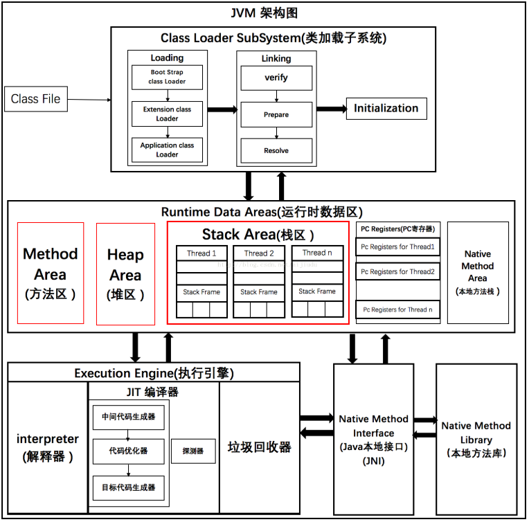
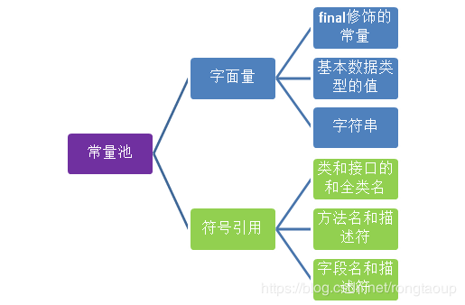
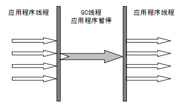
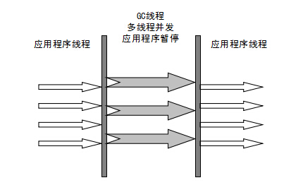
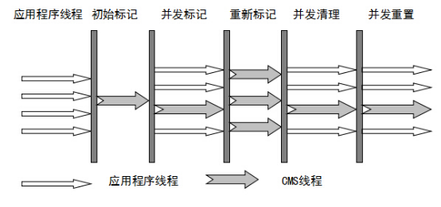
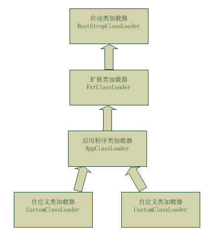

## jvm详解

### 1.JDK、JRE与JVM之间的关系：

- JDK全程为Java SE Development Kit（Java开发工具），提供了编译和运行Java程序所需的各种资源和工具，包括：JRE+java开发工具。
- JRE全称为Java runtime environment（Java运行环境），包括：虚拟机+java的核心类库。
- JVM是运行Java程序的核心虚拟机。


### 2.JVM体系架构



JVM主要有四个子系统：

1. 类加载器(Class Load SubSystem)
2. 运行时数据区：方法区，栈(Stack)，堆(Heap)，PC计数器，本地方法栈(Native Method)
3. 执行引擎(Execution Engine)
4. 本地方法接口 (Native Method Interface, JNI)，本地方法库

####   1. 类加载子系统

Java的动态类加载功能由该子系统处理，当它在运行时（不是编译时）首次引用一个类时，它加载、链接并初始化该类文件(.class文件)。

- 加载(Loading)

	类的加载在此组件中完成，加载过程主要由下面三个加载器实现：

	- 启动类加载器(BootStrap class Loader)。负责从启动类路径中加载类，rt.jar。这个加载器会被赋予最高优先级。
	- 扩展类加载器(Extension class Loader)。负责加载ext目录(jre\lib)内的类。
	- 应用程序类加载器(Application class Loader)。负责加载应用程序级别类路径，涉及到路径的环境变量等。

​        这三个类加载器会遵循委托层次算法(Delegation Hierarchy Algorithm)加载类文件。

- 链接(Linking)

	该过程主要完成以下三个步骤：

	- 校验(Verify)。字节码校验器会校验生成的字节码是否正确，如果校验失败，我们会得到校验错误。rt包的代码不需要校验。
	- 准备(Prepare)。分配内存并初始化默认值给所有的静态变量。
	- 解析(Resolve)。所有符号内存引用被方法区（Method Area）的原始引用所替代。

- 初始化(Initialization)

	这是类加载的最后阶段，这里所有的静态变量会赋初始值，并且静态块将被执行。

####   2. 运行时数据区

在JVM内存结构中介绍

####   3. 执行引擎

​        分配给运行时数据区的字节码将由执行引擎执行，执行引擎读取字节码并逐段执行。它包含了如下三个部分：解释器、编译器、垃圾回收器。

- 解释器(interpreter)。

	解释器能够快速地解释字节码，但执行却很慢。它的一个缺点就是，当一个方法被调用多次，每次都需要重新解释。

- JIT编译器。

	JIT编译器消除了解释器的缺点，执行引擎利用解释器转换字节码，但如果是重复的代码，则使用JIT编译器将全部字节码编译成本机代码，本机代码将直接用于重复的方法调用，这样提高了系统的性能。它的工作由下面4个工具协同完成：

	1. 中间代码生成器。负责生成中间代码。
	2. 代码优化器。负责优化上面生成的中间代码。
	3. 目标代码生成器。负责生成机器代码或本机代码。
	4. 探测器(Profiler)。一个特殊的组件，负责寻找被多次调用的方法。

- 垃圾回收器。

	搜集并删除未引用的对象。可以通过调用“System.gc()”来触发垃圾回收，但并不保证会确实进行垃圾回收。JVM的垃圾回收只收集那些由new关键字创建的对象。所以，如果不是用new创建的对象，你可以使用finalize函数来执行清理。

####   4. Java本地接口与本地方法库

  JNI会与本地方法库进行交互并提供执行引擎所需的本地库。

  本地方法库(Native Method Library)是一个执行引擎的本地库集合。 

### 3.JVM运行时内存结构

#### 3.1. PC计数器

程序计数器（Program Counter Register）是一块较小的内存空间，可以看作是当前线程所执行字节码的行号指示器，指向下一个将要执行的指令代码，由执行引擎来读取下一条指令。更确切的说，一个线程的执行，是通过字节码解释器改变当前线程的计数器的值，来获取下一条需要执行的字节码指令，从而确保线程的正确执行。

为了确保线程切换后（上下文切换）能恢复到正确的执行位置，每个线程都有一个独立的程序计数器，各个线程的计数器互不影响，独立存储。也就是说程序计数器是线程私有的内存。

如果线程执行 Java 方法，这个计数器记录的是正在执行的虚拟机字节码指令的地址；如果执行的是 Native 方法，计数器值为Undefined。

程序计数器不会发生内存溢出（OutOfMemoryError即OOM）问题。
#### 3.2 栈

JVM 中的栈包括 Java 虚拟机栈和本地方法栈，两者的区别就是，Java 虚拟机栈为 JVM 执行 Java 方法服务，本地方法栈则为 JVM 使用到的 Native 方法服务。一般java栈指java虚拟机栈。

栈是**线程私有**的，他的生命周期与线程相同。每个线程都会分配一个栈的空间，即**每个线程拥有独立的栈空间**。

**栈帧**是栈的元素。每个方法在执行时都会创建一个栈帧。栈帧中存储了**局部变量表、操作数栈、动态连接和方法出口**等信息。每个方法从调用到运行结束的过程，就对应着一个栈帧在栈中压栈到出栈的过程。

> 栈中可能出现哪些异常？
>

- StackOverflowError：栈溢出错误

如果一个线程在计算时所需要用到栈大小 > 配置允许最大的栈大小，那么Java虚拟机将抛出 StackOverflowError

- OutOfMemoryError：内存不足

 栈进行动态扩展时如果无法申请到足够内存，会抛出 OutOfMemoryError 异常。

> 局部变量表

栈帧中，由一个局部变量表存储数据。局部变量表中存储了基本数据类型（boolean、byte、char、short、int、float、long、double）的局部变量（包括参数）、和对象的引用（String、数组、对象等），但是不存储对象的内容。局部变量表所需的内存空间在编译期间完成分配，在方法运行期间不会改变局部变量表的大小。

局部变量的容量以变量槽（Variable Slot）为最小单位，每个变量槽最大存储32位的数据类型。对于64位的数据类型（long、double），JVM 会为其分配两个连续的变量槽来存储。以下简称 Slot 。

JVM 通过索引定位的方式使用局部变量表，索引的范围从0开始至局部变量表中最大的 Slot 数量。普通方法与 static 方法在第 0 个槽位的存储有所不同。非 static 方法的第 0 个槽位存储方法所属对象实例的引用。

为了节省栈帧空间，Slot是可以复用的，但会影响垃圾回收行为。

> 操作数栈

操作数栈是一个后进先出栈。操作数栈的元素可以是任意的Java数据类型。方法刚开始执行时，操作数栈是空的，在方法执行过程中，通过字节码指令对操作数栈进行压栈和出栈的操作。通常进行算数运算的时候是通过操作数栈来进行的，又或者是在调用其他方法的时候通过操作数栈进行参数传递。操作数栈可以理解为栈帧中用于计算的临时数据存储区。

> 如何设置栈参数？
>

使用 -Xss 设置栈大小，通常几百K就够用了。由于栈是线程私有的，线程数越多，占用栈空间越大。

栈决定了函数调用的深度。这也是慎用递归调用的原因。递归调用时，每次调用方法都会创建栈帧并压栈。当调用一定次数之后，所需栈的大小已经超过了虚拟机运行配置的最大栈参数，就会抛出 StackOverflowError 异常。
#### 3.3 堆

堆是Java虚拟机所管理的内存中最大的一块存储区域。堆内存被所有线程共享。主要存放使用new关键字创建的对象。所有对象实例以及数组都要在堆上分配。垃圾收集器就是根据GC算法，收集堆上对象所占用的内存空间（收集的是对象占用的空间而不是对象本身）。

Java堆分为年轻代（Young Generation）和老年代（Old Generation）；年轻代又分为伊甸园（Eden）和幸存区（Survivor区）；幸存区又分为From Survivor空间和 To Survivor空间，比例是8:1:1。

幸存区的From区和to区是动态转换的，空的区为to区。

年轻代存储“新生对象”，我们新创建的对象存储在年轻代中，又称新生代。当年轻内存占满后，会触发Minor GC，清理年轻代内存空间。

老年代存储长期存活的对象和大对象。年轻代中存储的对象，经过多次GC后仍然存活的对象会移动到老年代中进行存储。老年代空间占满后，会触发Full GC。

注：

- JDK1.8以前，堆内存包含一个永久代。JVM用元空间取代了永久代，永久代增加了GC的复杂度。
- Full GC是清理整个堆空间，包括年轻代和老年代。如果Full GC之后，堆中仍然无法存储对象，就会抛出OutOfMemoryError异常。

#### 3.4方法区

方法区同 Java 堆一样是被所有线程共享的区间，用于存储已被虚拟机加载的类信息、常量、静态变量、即时编译器编译后的代码。更具体的说，**静态变量+常量+类信息（版本、方法、字段等）+运行时常量池**存在方法区中。常量池是方法区的一部分。

JDK1.8之前方法区是用永久代实现的，JDK1.8 使用元空间 MetaSpace 替代方法区，元空间并不在 JVM中，而是使用本地内存。元空间两个参数：

 MetaSpaceSize：初始化元空间大小，控制发生GC阈值
 MaxMetaspaceSize ： 限制元空间大小上限，防止异常占用过多物理内存3.5 本地方法栈

> 常量池

常量池中存储编译器生成的各种字面量和符号引用。字面量就是Java中常量的意思。比如文本字符串，final修饰的常量等。方法引用则包括类和接口的全限定名，方法名和描述符，字段名和描述符等。




**优点：**常量池避免了频繁的创建和销毁对象而影响系统性能，其实现了对象的共享。

Interger常量池与String常量池

当处于基本数据类型范围内是在常量迟创建.

``` java
String s1="tang"; //常量池
String s2=s1+"jia"; //堆， jvm对于 +优化，new StringBuilder对象,调用append方法实现 + 运算
```

> **String对象的intern方法。**

String 调用 intern 方法，返回的是的内容在常量池中的值

### 4.GC垃圾回收

#### 4.1垃圾回收机制

GC只针对堆内存和元空间，GC的触发条件。

- 会在cpu空闲的时候自动进行回收 ；

- 在堆内存存储满了之后； 　

- 主动调用System.gc()后尝试进行回收；

GC回收方法区(元空间，永久代)时“无用的类”判定条件：

1. 该类的所有实例都已经被回收(即在Java堆中不存在任何该类的实例)
2. 加载该类的ClassLoader已被回收
3. 该类对应的Class对象没有任何其他地方被引用，无法在任何地方通过反射访问该类的方法

GC流程：

- 堆内存中伊甸园区(新生代)满了，触发YoungGC(轻GC)，同时对from区进行GC,将两部分的幸存者全部移入to区；此时to区转变为from区，from区转变为to区。幸存者经历了15次GC仍然存活则移入老年代。
- 老年代内存满了触发重GC(Full GC)。

#### 4.2 垃圾判定算法

> ###### 引言计数法

引用计数算法是通过判断对象的**引用数量**来决定对象是否可以被回收。

给对象中添加一个引用计数器，每当有一个地方引用它时，计数器值就加1；当引用失效时，计数器值就减1；任何时刻计数器为0的对象就是不可能再被使用的。

优点：简单，高效，现在的objective-c用的就是这种算法。

缺点：很难处理循环引用，相互引用的两个对象则无法释放。**因此目前主流的Java虚拟机都摒弃掉了这种算法**。

> ###### 可达性分析算法

可达性分析算法是通过判断对象的引用链是否可达来决定对象是否可以被回收。

从GC Roots（每种具体实现对GC Roots有不同的定义）作为起点，向下搜索它们引用的对象，可以生成一棵引用树，树的节点视为可达对象，反之视为不可达。

在Java语言中，可以作为GC Roots的对象包括下面几种：

- 虚拟机栈（栈帧中的本地变量表）中的引用对象。
- 方法区中的类静态属性引用的对象。
- 方法区中的常量引用的对象。
- 本地方法栈中JNI（Native方法）的引用对象

**真正标记以为对象为可回收状态至少要标记两次。**

> ###### 四种引用

**强引用**就是指在程序代码之中普遍存在的，类似"Object obj = new Object()"这类的引用，只要强引用还存在，垃圾收集器永远不会回收掉被引用的对象。

```java
Object obj = new Object();
```

**软引用**是用来描述一些还有用但并非必需的对象，对于软引用关联着的对象，在系统将要发生内存溢出异常之前，将会把这些对象列进回收范围进行第二次回收。如果这次回收还没有足够的内存，才会抛出内存溢出异常。在JDK1.2之后，提供了SoftReference类来实现软引用。

```java
Object obj = new Object();
SoftReference<Object> sf = new SoftReference<Object>(obj);
```

**弱引用**也是用来描述非必需对象的，但是它的强度比软引用更弱一些，被弱引用关联的对象，只能生存到下一次垃圾收集发生之前。当垃圾收集器工作时，无论当前内存是否足够，都会回收掉只被弱引用关联的对象。在JDK1.2之后，提供了WeakReference类来实现弱引用。

```java
Object obj = new Object();
WeakReference<Object> wf = new WeakReference<Object>(obj);
```

**虚引用**也成为幽灵引用或者幻影引用，它是最弱的一中引用关系。一个对象是否有虚引用的存在，完全不会对其生存时间构成影响，也无法通过虚引用来取得一个对象实例。为一个对象设置虚引用关联的唯一目的就是能在这个对象被收集器回收时收到一个系统通知。在JDK1.2之后，提供给了PhantomReference类来实现虚引用。

```java
Object obj = new Object();
PhantomReference<Object> pf = new PhantomReference<Object>(obj);
```

#### 4.3 GC算法

GC算法主要有如下：

- 标记清除算法

- 标记整理算法

- 复制算法

- 分代收集算法

> 标记清除算法

标记清除算法分为“标记”和“清除”两个阶段：首先标记出所有需要回收的对象，在标记完成后统一回收所有被标记的对象。

之所以说他是最基础的收集算法，是因为后续的收集算法都是基于这种思路并且对其不足进行改进而得到的。

它的主要不足有两个：

- 效率问题，标记和清除两个过程的效率都不高；

- 空间问题，标记清除后会产生大量不连续的内存碎片，空间碎片太多可能会导致以后再程序运行过程中需要分配较大对象时，无法找到足够的连续的内存而不得不提前触发另一次垃圾收集动作。

> 标记整理算法

标记整理算法是在标记清楚算法基础上改进得到的。

复制收集算法在对象存活率较高时就要进行较多的复制操作，效率将会变低。更关键的是，如果不想浪费50%的空间，就需要有额外的空间进行分配担保，以应对被使用的内存中所有对象都100%存活的极端情况，所以在老年代一般不能直接选用这种算法。标记整理算法的标记过程类似标记清除算法，但后续步骤不是直接对可回收对象进行清理，而是让所有存活的对象都向一端移动，然后直接清理掉端边界以外的内存，类似于磁盘整理的过程，该垃圾回收算法适用于对象存活率高的场景（老年代）。

> 复制算法

复制算法将可用内存按容量划分为大小相等的两块，每次只使用其中的一块。当这一块的内存用完了，就将还存活着的对象复制到另外一块上面，然后再把已使用过的内存空间一次清理掉。这种算法适用于对象存活率低的场景，比如新生代。这样使得每次都是对整个半区进行内存回收，内存分配时也就不用考虑内存碎片等复杂情况，只要移动堆顶指针，按顺序分配内存即可，实现简单，运行高效。

> 分代收集算法

这种算法并没有什么新的思路，只是根据对象的存活周期的不同，将内存划分为几块。一般是把java堆分成新生代和老年代，这样就可以根绝各个年代的特点采取最适当的收集算法。在新生代中，每次垃圾回收时都发现大批对象的死去，只有少量存活，那就选用复制算法，只需要付出少量存活对象的复制成本就可以完成收集。而老年代中因为对象存活率高，没有额外空间对它进行分配担保，就必须使用"标记-清理”或者“标记-整理”算法来进行回收。

一般地：新生代采用复制算法和标记清除，老年代和元空间(永久代)采用标记整理算法。

#### 4.4 垃圾收集器

> ###### 新生代收集器

- **Serial 垃圾收集器（单线程复制）**

在垃圾收集过程中停止一切用户线程(Stop The World)，适合客户端使用。



- **ParNew 垃圾收集器（Serial+多线程）**

Serial 的多线程版本，但线程切换需要额外的开销，因此在单 CPU 环境中表现不如 Serial，清理过程依然需要 Stop The World。



- **Parallel Scavenge 垃圾收集器（多线程）**

Parallel Scavenge 和 ParNew 一样，都是多线程、新生代垃圾收集器。但是两者有巨大的不同点：

- Parallel Scavenge：追求 CPU 吞吐量，能够在较短时间内完成指定任务，因此适合没有交互的后台计算。
- ParNew：追求降低用户停顿时间，适合交互式应用。

吞吐量 = 运行用户代码时间 / (运行用户代码时间 + 垃圾收集时间)

> ###### 老年代垃圾收集器

- **Serial Old 垃圾收集器（单线程标记整理算法）**

Serial 的老年代版本，区别：Serial Old 工作在老年代，使用“标记-整理”算法；Serial 工作在新生代，使用“复制”算法。

- **Parallel Old 垃圾收集器（多线程标记整理算法）**

Parallel Scavenge 的老年代版本，追求 CPU 吞吐量。

- **CMS 垃圾收集器(多线程标记清除算法)**

CMS(Concurrent Mark Sweep，并发标记清除)收集器是以获取最短回收停顿时间为目标的收集器（追求低停顿），它在垃圾收集时使得用户线程和 GC 线程并发执行，因此在垃圾收集过程中用户也不会感到明显的卡顿。



> ###### G1通用收集器

面向服务端应用的垃圾收集器，它没有新生代和老年代的概念，而是将堆划分为一块块独立的 Region。当要进行垃圾收集时，首先估计每个 Region 中垃圾的数量，每次都从垃圾回收价值最大的 Region 开始回收，因此可以获得最大的回收效率。

从整体上看， G1 是基于“标记-整理”算法实现的收集器，从局部（两个 Region 之间）上看是基于“复制”算法实现的，这意味着运行期间不会产生内存空间碎片。

- 并发并行
- 分代收集
- 空间整合
- 可预测停顿

### 5. 其他机制

#### 双亲委派机制

亲委派模型是Java加载类的机制.采用双亲委派模型的好处是Java类随着它的类加载器一起具备了一种带有优先级的层级关系，通过这种层级关系可以避免类的重复加载.

双亲委派机制的工作过程：

1. 类加载器收到类加载的请求；

2. 把这个请求委托给父加载器去完成，一直向上委托，直到启动类加载器；

3. 启动器加载器检查能不能加载（使用findClass()方法），能就加载（结束）；否则，抛出异常，通知子加载器进行加载。

4. 重复步骤三；



#### JVM沙箱机制

JVM的沙箱机制保证了java是安全的，由4部分组成：

- 类装载器(类加载子系统)

- Class文件检验器

	Class文件检验器保证装载的class文件内容的内部结构的正确，并且这些class文件相互协调一致。
	Class文件检验器实现的安全目标之一就是程序的健壮性，JAVA虚拟机的class文件检验器要进行四趟扫描来完成它的操作：

	> 第一趟：此次扫描是在类被装载的时候进行的，在这次扫描中，class文件检验器检查这个class文件的内部结构，以确保它能够被安全的编译。
	>
	> 第四趟：这次扫描是在进行动态连接的过程中解析符号引用时进行的，在这次扫描中，class文件检验器确认被引用的类、字段以及方法确实存在。

- 内置与Java虚拟机的安全特性

	1. 类型安全的引用转换
	2. 结构化的内存访问
	3. 自动垃圾收集
	4. 数组边界检查
	5. 空引用检查

- 安全管理及Java API

	Java安全模型的前三个组成部分——类装载器体系结构，class文件检验器及java中的内置安全特性一起达到一个共同的目的：保持java虚拟机的实例和它正在运行的应用程序的内部完整性，使得它们不被恶意代码侵犯。
	相反，这个安全模型的第四个组成部分是安全管理器，它主要用于保护虚拟机的外部资源不被虚拟机内运行的恶意代码侵犯。这个安全管理器是一个单独的对象，在运行的java虚拟机中，它在访问控制对于外部资源的访问中起中枢的作用。