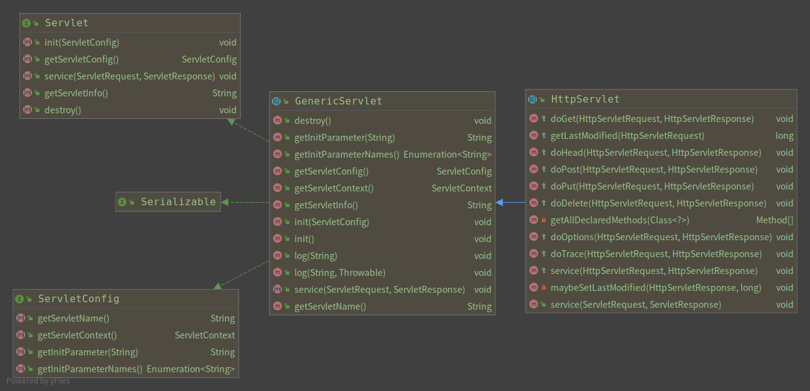
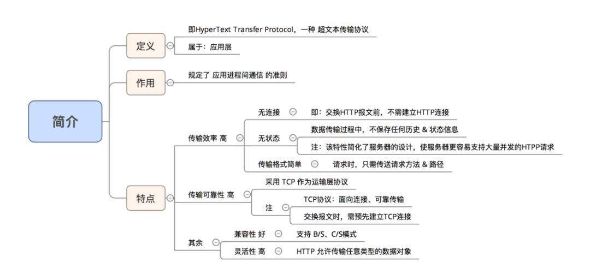
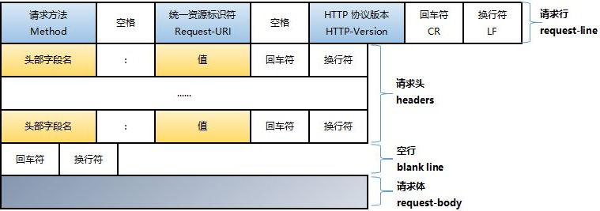
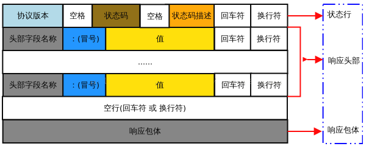
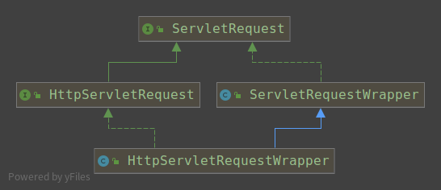

## Servlet

### 1. 引言

#### 简介

Servlet 为创建基于 web 的应用程序提供了基于组件、独立于平台的方法，可以不受 CGI 程序的性能限制。Servlet 有权限访问所有的 Java API，包括访问企业级数据库的 JDBC API。

Servlet是在服务器上运行的小程序，也就是一个Java类，但比较特殊，不需要new，自动就可以运行。也有创建、垃圾回收和销毁过程。Servlet是JavaWeb的三大组件之一（Servlet、Filter、Listener），它属于动态资源。Servlet的作用是处理请求，服务器会把接收到的请求交给Servlet来处理，在Servlet中通常需要：

- 接收请求数据；
- 处理请求；
- 完成响应

#### 环境设置

``` xml
    <dependencies>
    <!--Servlet基础jar包-->
    <dependency>
        <groupId>javax.servlet</groupId>
        <artifactId>javax.servlet-api</artifactId>
        <version>3.0.1</version>
        <scope>provided</scope>
    </dependency>
    <dependency>
        <groupId>javax.servlet.jsp</groupId>
        <artifactId>jsp-api</artifactId>
        <version>2.2</version>
        <scope>provided</scope>
    </dependency>
    </dependencies>
```


ServletAPI结构体系

  Servlet API 包含以下4个Java包：

1.javax.servlet   其中包含定义servlet和servlet容器之间契约的类和接口。

2.javax.servlet.http   其中包含定义HTTP Servlet 和Servlet容器之间的关系。

3.javax.servlet.annotation   其中包含标注servlet，Filter,Listener的标注。。

4.javax.servlet.descriptor，其中包含提供程序化登录Web应用程序的配置信息的类型。



实现Servlet

- 继承GenericServlet:抽象类，与协议无关的servlet实现类
- 继承HttpServlet:抽象类，doget(),dopost(),处理http请求的实现类
- 自定义servlet:  实现servlet接口，注册servelet类，配置路径

#### 生命周期

- init()   首次创建Serlet时被调用

	当用户调用一个 Servlet 时，就会创建一个 Servlet 实例，每一个用户请求都会产生一个新的线程，适当的时候移交给 doGet 或 doPost 方法。init() 方法简单地创建或加载一些数据，这些数据将被用于 Servlet 的整个生命周期。

- service()方法	service()是执行实际任务的主要方法

	Servlet 容器（即 Web 服务器）调用 service() 方法来处理来自客户端（浏览器）的请求，并把格式化的响应写回给客户端。

	每次服务器接收到一个 Servlet 请求时，服务器会产生一个新的线程并调用服务。service() 方法检查 HTTP 请求类型（GET、POST、PUT、DELETE 等），并在适当的时候调用 doGet、doPost、doPut，doDelete 等方法。

- destroy() 方法    只会调用一次，在声明周期结束时被调用

	Servlet关闭数据库连接，停止后天进程，把Cookie列表写入磁盘等清理活动。

#### Servlet线程安全

整个生命周期是单实例，但每次访问时为多线程。解决方法：

- 单实例变成多实例，但过时了，因为耗费资源多，服务器压力大。

- 加线程锁，但数据会重复出现(没有同步机制)，且运行效率低。

- 解决线程安全问题的最佳办法：不要写全局变量，而写局部变量(即改变变量的作用域)

### 2. Servlet实例

#### HelloServlet

``` java
// 导入必需的 java 库
import java.io.*;
import javax.servlet.*;
import javax.servlet.http.*;

// 扩展 HttpServlet 类
public class HelloWorld extends HttpServlet {
	private String message;
  public void init() throws ServletException
  {
      // 执行必需的初始化
      message = "Hello World";
  }
  public void doGet(HttpServletRequest request,
                    HttpServletResponse response)
            throws ServletException, IOException
  {
      // 设置响应内容类型
      response.setContentType("text/html");
      // 实际的逻辑是在这里
      PrintWriter out = response.getWriter();
      out.println("<h1>" + message + "</h1>");
  }
  public void destroy()
  {
      // 什么也不做
  }
}
```

#### 映射Map

对servlet配置有两种方法

- web.xml对servlet配置路径和参数
- 注解配置

一个servlet可以配置多个映射路径(或者说：多个映射路径可以指向同一个servlet)，只要是name是一样的就行。

通配符 \* 代表任意字符串

- url-pattern：*.xxx     以.xxx结尾的请求都可以访问  注：不要加/*
- *url-pattern：/*        以任意字符串结尾的请求都可以访问
- url-pattern：/xxxx/*   以/xxxx/开头的请求都可以访问

#### ServletContext

web容器启动的时候，为每个web程序创建一个对应的ServletContext对象，代表当前的web应用。

- ServletContext对象的创建是在服务器启动时完成的；
- ServletContext对象的销毁是在服务器关闭时完成的。

ServletContext应用：

- 共享数据：在一个Servlet保存的数据，可以在另一个servlet中拿到

- 获取全局配置信息：

	``` java
	public String getInitParamenter(String name) // 根据配置文件中的key得到value
	```

- 读取简单的资源文件(即只包含key=value的形式)：

	```java
	public String getRealPath(String path)// 根据资源名称得到资源的绝对路径，可以得到当前应用任何位置的资源
	```

### 3. Servlet转发与重定向

转发和重定向都能让浏览器获得另外一个URL所指向的资源，但两者的内部运行机制有着很大的区别。

1、转发：有两种方式获得转发对象(RequestDispatcher)：一种是通过HttpServletRequest的getRequestDispatcher()方法获得，一种是通过ServletContext的getRequestDispatcher()方法获得；

​     以前的request范围中存放的变量不会失效，就像把两个页面拼到了一起。 例如:

request.getRequestDispatcher (“demo.jsp"). forward(request, response);//转发到demo.jsp

​     详解：假设浏览器访问servlet1，而servlet1想让servlet2为客户端服务。此时servlet1调用forward（）方法，将请求转发给servlet2。但是调用forward()方法，对于浏览器来说是透明的，浏览器并不知道为其服务的Servlet已经换成Servlet2，它只知道发出了一个请求，获得了一个响应。浏览器URL的地址栏不变。

2、重定向：HttpServletResponse的sendRedirect()方法。

​     服务器根据此请求寻找资源并发送给客户，它可以重定向到任意URL，不能共享request范围内的数据。例如:response.sendRedirect(“demo.jsp");//重定向到demo.jsp

​     详解：假设浏览器访问servlet1，而servlet1想让servlet2为客户端服务。此时servlet1调用sendRedirect()方法，将客户端的请求重新定向到Servlet2。接着浏览器访问servlet2，servlet2对客户端请求作出反应。浏览器URL的地址栏改变。

3、主要区别：

（1）sendRedirect()方法不但可以在位于同一个主机上的不同Web应用程序之间进行重定向，而且可以将客户端重定向到其他服务器上的Web应用程序资源。而forward（）方法只能将请求转发给同一Web应用的组件。

（2）sendRedirect()方法不能转发到“/WEB-INF/”路径下的jsp页面资源，而getRequestDispatcher().forword()可以重定向到“/WEB-INF/”路径下的jsp页面资源。如 request.getRequestDispatcher("/WEB-INF/jsp/login.jsp").forward(request, response);

（3）转发：浏览器URL的地址栏不变。

​        重定向：浏览器URL的地址栏改变。

### 4. HTTP请求与响应

#### HTTP协议

HTTP是基于TCP/IP通信协议传输数据，用于CS架构上万维网服务器传输超文本到本地浏览器的传输协议

> ###### HTTP协议




CGI(Common Gateway Interface) 是 HTTP 服务器与你的或其它机器上的程序进行“交谈”的一种工具，其程序须运行在网络服务器上。

绝大多数的 CGI 程序被用来解释处理来自表单的输入信息，并在服务器产生相应的处理，或将相应的信息反馈给浏览器。CGI 程序使网页具有交互功能。

> ###### HTTP消息结构

- HTTP请求消息结构，请求头和请求体，具体的如下：



- HTTP响应消息结构，响应头和响应体，具体如下：




#### HTTP请求常用方法

HTTP1.0 定义了三种请求方法： GET, POST 和 HEAD方法。

HTTP1.1 新增了六种请求方法：OPTIONS、PUT、PATCH、DELETE、TRACE 和 CONNECT 方法。

JAVA Servlet API中的常用方法：

> - Cookie[] getCookies()
> 	返回一个数组，包含客户端发送该请求的所有的 Cookie 对象。
>
> - Enumeration getAttributeNames()
> 	返回一个枚举，包含提供给该请求可用的属性名称。
>
> - HttpSession getSession()
> 	返回与该请求关联的当前 session 会话，或者如果请求没有 session 会话，则创建一个。
>
> - HttpSession getSession(boolean create)
> 	返回与该请求关联的当前 HttpSession，或者如果没有当前会话，且创建是真的，则返回一个新的 session 会话。
>
> - String getRequestedSessionId()
> 	返回由客户端指定的 session 会话 ID。
>
> - Object getAttribute(String name)
> 	以对象形式返回已命名属性的值，如果没有给定名称的属性存在，则返回 null。
>
> - String getCharacterEncoding()
> 	返回请求主体中使用的字符编码的名称。
>
> - String getContentType()
> 	返回请求主体的 MIME 类型，如果不知道类型则返回 null。
>
> - String getContextPath()
> 	返回指示请求上下文的请求 URI 部分。
>
> - String getQueryString()
> 	返回包含在路径后的请求 URL 中的查询字符串。
>
> - String getRemoteUser()
> 	如果用户已通过身份验证，则返回发出请求的登录用户，或者如果用户未通过身份验证，则返回 null。
>
> - int getParameterMap()
> 	将参数封装成 Map 类型。 
>

#### 设置HTTP响应头的方法

HTTP响应头信息

| Allow               | 这个头信息指定服务器支持的请求方法（GET、POST 等）。         |
| :------------------ | :----------------------------------------------------------- |
| Cache-Control       | 这个头信息指定响应文档在何种情况下可以安全地缓存。           |
| Connection          | 这个头信息指示浏览器是否使用持久 HTTP 连接。值 **close** / **keep-alive** |
| Content-Disposition | 这个头信息可以让您请求浏览器要求用户以给定名称的文件把响应保存到磁盘。 |
| Content-Encoding    | 在传输过程中，这个头信息指定页面的编码方式。                 |
| Content-Language    | 这个头信息表示文档编写所使用的语言。例如，en、en-us、ru 等。 |
| Content-Length      | 指示响应中的字节数。只有当浏览器使用持久HTTP 连接时才需要这些信息。 |
| Content-Type        | 提供了响应文档的 MIME（Multipurpose Internet Mail Extension）类型。 |
| Expires             | 指定内容过期的时间，在这之后内容不再被缓存。                 |
| Last-Modified       | 指示文档的最后修改时间。                                     |
| Location            | 被包含在所有的带有状态码的响应中,通知浏览器文档地址,浏览器会自动重新连接 |
| Refresh             | 这个头信息指定浏览器应该如何尽快请求更新的页面。您可以指定页面刷新的秒数。 |
| Retry-After         | 可以与 503（ 服务不可用）响应配合使用，告诉客户端多久就可以重复它的请求。 |
| Set-Cookie          | 这个头信息指定一个与页面关联的 cookie。                      |

常用方法

> - void reset()
> 	清除缓冲区中存在的任何数据，包括状态码和头。
>
> - void resetBuffer()
> 	清除响应中基础缓冲区的内容，不清除状态码和头。
>
> - void setCharacterEncoding(String charset)
> 	设置被发送到客户端的响应的字符编码（MIME 字符集）例如，UTF-8。
>
> - void setStatus(int sc)
> 	为该响应设置状态码。
>
> - void setIntHeader(String name, int value)
> 	设置一个带有给定的名称和整数值的响应报头。
>

#### HttpServletResponse

web服务器接收到客户端的http请求，针对这个请求，分别创建一个代表请求的HttpservletResquest对象，代表响应一个HttpServletResponse

- 要获取客户端请求过来的参数：HttpServletResquest
- 要给客户端响应一些信息：HttpeServletResponse

API中继承与接口实现：


应用：

- 向浏览器输出消息
- 下载文件
	1. 获取下载文件路径
	2. 下载文件的文件有两种方式获得转发对象(RequestDispatcher)：一种名
	3. 设置下载支持
	4. 获取下载输入流
	5. 创建缓冲流
	6. 获取OutputStream对象
	7. 将FileOutputStream流写入到buffer缓冲区
	8. 使用OutputStream将缓冲区中的数据输出到客户端

- 验证码
- 实现重定向


#### HttpServletRequest

HttpServletRequest代表客户端请求，用户通过Http协议访问服务器，Http请求的所有信息会被封装到HttpServletRequest对象中，通过该对象的get方法获取信息

API中的继承与接口实现：



应用：

- 获取前端传递参数
- 请求转发

### 5. Cookie和Session

cookie是客户端的处理，Session是服务端的处理

#### Cookie处理

Cookie 是存储在客户端计算机上的文本文件，并保留了各种跟踪信息。Java Servlet 显然支持 HTTP Cookie。

识别返回用户包括三个步骤：

- 服务器脚本向浏览器发送一组 Cookie。例如：姓名、年龄或识别号码等。
- 浏览器将这些信息存储在本地计算机上，以备将来使用。
- 当下一次浏览器向 Web 服务器发送任何请求时，浏览器会把这些 Cookie 信息发送到服务器，服务器将使用这些信息来识别用户。

Cookie 通常设置在 HTTP 头信息中,设置 Cookie 的 Servlet 会发送如下的头信息：

``` javascript
HTTP/1.1 200 OK
Date: Fri, 04 Feb 2000 21:03:38 GMT
Server: Apache/1.3.9 (UNIX) PHP/4.0b3
Set-Cookie: name=xyz; expires=Friday, 04-Feb-07 22:03:38 GMT; 
                 path=/; domain=runoob.com
Connection: close
Content-Type: text/html
```

Set-Cookie 头包含了一个名称值对、一个 GMT 日期、一个路径和一个域。名称和值会被 URL 编码。expires 字段是一个指令，告诉浏览器在给定的时间和日期之后"忘记"该 Cookie。

如果浏览器被配置为存储 Cookie，它将会保留此信息直到到期日期。如果用户的浏览器指向任何匹配该 Cookie 的路径和域的页面，它会重新发送 Cookie 到服务器。

Servlet Cookie 方法

> - public void setDomain(String pattern)
>
> 	该方法设置 cookie 适用的域，例如 runoob.com。
>
> - public String getDomain()
>
> 	该方法获取 cookie 适用的域，例如 runoob.com。
>
> - public void setMaxAge(int expiry)
>
> 	该方法设置 cookie 过期的时间（以秒为单位）。如果不这样设置，cookie 只会在当前 session 会话
>
> 	中持续有效。
>
> - public int getMaxAge()
>
> 	该方法返回 cookie 的最大生存周期（以秒为单位），默认情况下，-1 表示 cookie 将持续下去，直
>
> 	到浏览器关闭。
>
> - public String getName()
>
> 	该方法返回 cookie 的名称。名称在创建后不能改变。
>
> - public void setValue(String newValue)
>
> 	该方法设置与 cookie 关联的值。
>
> - public String getValue()
>
> 	该方法获取与 cookie 关联的值。
>
> - public void setPath(String uri)
>
> 	该方法设置 cookie 适用的路径。如果您不指定路径，与当前页面相同目录下的（包括子目录下的）所有 URL 都会返回 cookie。
>
> - public String getPath()
>
> 	该方法获取 cookie 适用的路径。
>
> - public void setSecure(boolean flag)
>
> 	该方法设置布尔值，表示 cookie 是否应该只在加密的（即 SSL）连接上发送。
>
> - public void setComment(String purpose)
> 	设置cookie的注释。该注释在浏览器向用户呈现 cookie 时非常有用。
> - public String getComment()
> 	获取 cookie 的注释，如果 cookie 没有注释则返回 null。

#### 通过 Servlet 设置 Cookie

 包括三个步骤：

**(1) 创建一个 Cookie 对象：**您可以调用带有 cookie 名称和 cookie 值的 Cookie 构造函数，cookie 名称和 cookie 值都是字符串。

```java
Cookie cookie = new Cookie("key","value");
```

请记住，无论是名字还是值，都不应该包含空格或以下任何字符：

```markdown
[ ] ( ) = , " / ? @ : ;
```

**(2) 设置最大生存周期：**您可以使用 setMaxAge 方法来指定 cookie 能够保持有效的时间（以秒为单位）。下面将设置一个最长有效期为 24 小时的 cookie。

```java
cookie.setMaxAge(60*60*24); 
```

**(3) 发送 Cookie 到 HTTP 响应头：**您可以使用 **response.addCookie** 来添加 HTTP 响应头中的 Cookie，如下所示：

``` java
response.addCookie(cookie);
```

#### Session处理（重点）

什么是Session

服务端为了保护用户状态而创建的一个特殊的对象

- 服务器会给每一个用户（浏览器）创建一个Session对象
- 一个Sessio独占一个浏览器，只要浏览器没有关闭，这个Session一直存在

> Session依赖于cookie，其过程是：

- 当浏览器第一次访问服务器时，服务器会创建session对象(该对象有一个唯一的id,一般称之为sessionId),接下来服务器会将sessionId以cookie的方式发送给浏览器。
- 当浏览器再次访问服务器时，会将sessionId发送过来，服务器就可以依据sessionId找到对应的sessinon对象。

> URL重写

客户端可能关闭了Cookie，或者浏览器不支持Cookie，URL重写是另一种Session的实现方式

您可以在每个 URL 末尾追加一些额外的数据来标识 session 会话，服务器会把该 session 会话标识符与已存储的有关 session 会话的数据相关联。

例如，http://w3cschool.cc/file.htm;sessionid=12345，session 会话标识符被附加为 sessionid=12345，标识符可被 Web 服务器访问以识别客户端。

URL 重写是一种更好的维持 session 会话的方式，它在浏览器不支持 cookie 时能够很好地工作，但是它的缺点是会动态生成每个 URL 来为页面分配一个 session 会话 ID，即使是在很简单的静态 HTML 页面中也会如此。

> 隐藏表单

一个 Web 服务器可以发送一个隐藏的 HTML 表单字段，以及一个唯一的 session 会话 ID，如下所示：

```html
<input type="hidden" name="sessionid" value="12345">
```

该条目意味着，当表单被提交时，指定的名称和值会被自动包含在 GET 或 POST 数据中。每次当 Web 浏览器发送回请求时，session_id 值可以用于保持不同的 Web 浏览器的跟踪。

这可能是一种保持 session 会话跟踪的有效方式，但是点击常规的超文本链接（<A HREF...>）不会导致表单提交，因此隐藏的表单字段也不支持常规的 session 会话跟踪。

#### HttpSession对象

Servlet提供了HttpSession接口，Servlet容器使用该接口创建了HTTPSession接口，该接口提供了一种跨多个页面请求或访问网站时识别用户以及存储有关用户信息的方式。

Servlet容器使用这个接口创建了Http客户端与服务器之间的Session会话。会话持续一个指定时间段，跨多个连接或者页面请求，可通过HttpServletRequest的公共方法getSeesion()来获取HtppSession对象：

```java
HttpSession session=request.getSession();
```

Httpsession对象的常用方法：

| 序号 | 方法 & 描述                                                  |
| :--- | :----------------------------------------------------------- |
| 1    | **public Object getAttribute(String name)** <br />该方法返回在该 session 会话中具有指定名称的对象，如果没有指定名称的对象，则返回 null。 |
| 2    | **public Enumeration getAttributeNames()** <br />该方法返回 String 对象的枚举，String 对象包含所有绑定到该 session 会话的对象的名称。 |
| 3    | **public long getCreationTime()** <br />该方法返回该 session 会话被创建的时间，自格林尼治标准时间 1970 年 1 月 1 日午夜算起，以毫秒为单位。 |
| 4    | **public String getId()** <br />该方法返回一个包含分配给该 session 会话的唯一标识符的字符串。 |
| 5    | **public long getLastAccessedTime()** <br />该方法返回客户端最后一次发送与该 session 会话相关的请求的时间自格林尼治标准时间 1970 年 1 月 1 日午夜算起，以毫秒为单位。 |
| 6    | **public int getMaxInactiveInterval()** <br />该方法返回 Servlet 容器在客户端访问时保持 session 会话打开的最大时间间隔，以秒为单位。 |
| 7    | **public void invalidate()** <br />该方法指示该 session 会话无效，并解除绑定到它上面的任何对象。 |
| 8    | **public boolean isNew()** <br />如果客户端还不知道该 session 会话，或者如果客户选择不参入该 session 会话，则该方法返回 true。 |
| 9    | **public void removeAttribute(String name)** <br />该方法将从该 session 会话移除指定名称的对象。 |
| 10   | **public void setAttribute(String name, Object value)** <br />该方法使用指定的名称绑定一个对象到该 session 会话。 |
| 11   | **public void setMaxInactiveInterval(int interval)** <br />该方法在 Servlet 容器指示该 session 会话无效之前，指定客户端请求之间的时间，以秒为单位。 |

