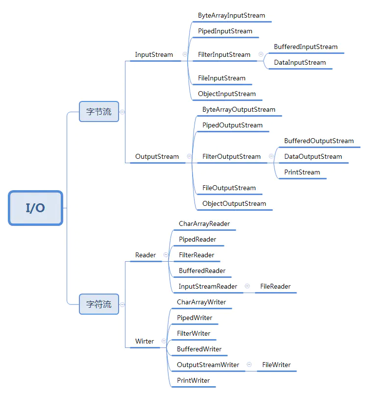
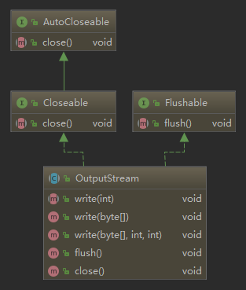
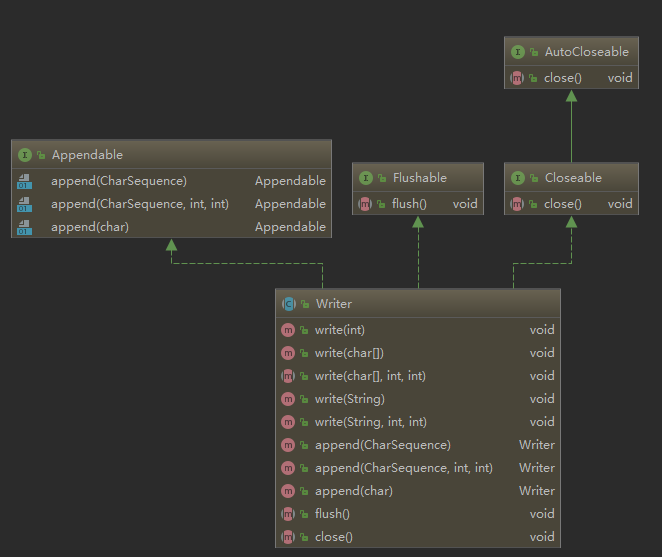

Java IO流式编程
---------------

### 1. IO 基本分类

从数据来源或者说是操作对象角度看，IO 类可以分为：

- 1、文件（file）：FileInputStream、FileOutputStream、FileReader、FileWriter
- 2、数组（[]）： 
	- 2.1、字节数组（byte[]）：ByteArrayInputStream、ByteArrayOutputStream
	- 2.2、字符数组（char[]）：CharArrayReader、CharArrayWriter
- 3、管道操作：PipedInputStream、PipedOutputStream、PipedReader、PipedWriter
- 4、基本数据类型：DataInputStream、DataOutputStream
- 5、缓冲操作：BufferedInputStream、BufferedOutputStream、BufferedReader、BufferedWriter
- 6、打印：PrintStream、PrintWriter
- 7、对象序列化反序列化：ObjectInputStream、ObjectOutputStream
- 8、转换：InputStreamReader、OutputStreWriter
- 9、~~字符串（String）~~**Java8中已废弃**：~~StringBufferInputStream、StringBufferOutputStream、StringReader、StringWriter~~

从数据传输方式来看可以分为两大类，字节流，字符流



### 2. IO类和方法

一般传统IO可分为4类：

- InputStream，OutputStream基于字节符操作的IO
- Write，Reader基于字符操作的IO
- File 基于磁盘操作的IO
- Socket 基于网络操作的IO

#### InputStream抽象类


```java
InputStream inputStream = new FileInputStream("D:\\log.txt");  //创建流对象 ,从文件读数据
byte[] bytes_test = new byte[inputStream.available()];
inputStream.read(bytes_test);
String str = new String(bytes_test, "utf-8");
System.out.println(str);
inputStream.close();
```

- abstract int read() ：读取一个字节数据，并返回读到的数据，如果返回 -1，表示读到了输入流的末尾。
- int read(byte[] b) ：将数据读入一个字节数组，同时返回实际读取的字节数。如果返回-1，表示读到了输入流的末尾。
- int read(byte[] b, int off, int len) ：将数据读入一个字节数组，同时返回实际读取的字节数。如果返回 -1，表示读到了输入流的末尾。off 指定在数组 b 中存放数据的起始偏移位置；len 指定读取的最大字节数。

InputStream

- ByteArrayInputStream
- FileInputStream
- FilterInputStream
- PushbackInputStream
- DataInputStream
- BufferedInputStream
- LineNumberInputStream
- ObjectInputStream
- PipedInputStream
- SequenceInputStream
- StringBufferInputStream

总结：

1. InputStream 是所有的输入字节流的父类，它是一个抽象类。
2. PushbackInputStream、DataInputStream 和 BufferedInput Stream都是处理流，他们的的父类是 FilterInputStream。
3. ByteArrayInputStream、StringBufferInputStream、FileInputStream 是三种基本的介质流，它们分别从 Byte 数组、StringBuffer、和本地文件中读取数据。PipedInputStream 是从与其它线程共用的管道中读取数据。

#### OutputStream抽象类



```java
OutputStream outputStream = new FileOutputStream("D:\\log.txt",true); // true表示是否追加
outputStream.write("你好，老王".getBytes("utf-8"));
outputStream.close();
```

outputStream中的三个基本的写方法

- abstract void write(int b)：往输出流中写入一个字节。
- void write(byte[] b) ：往输出流中写入数组b中的所有字节。
- void write(byte[] b, int?off, int?len) ：往输出流中写入数组 b 中从偏移量 off 开始的 len 个字节的数据。

其它重要方法：

- void flush() ：刷新输出流，强制缓冲区中的输出字节被写出。
- void close() ：关闭输出流，释放和这个流相关的系统资源。

在FileInputStream和OutputStream中的方法

- **protected void finalize()throws IOException {}**

	清除与该文件的连接。确保在不再引用文件输入流时调用其 close 方法。抛出IOException异常。

- **public int available() throws IOException{}**

	返回下一次对此输入流调用的方法可以不受阻塞地从此输入流读取的字节数。返回一个整数值。

OutputStream

- ByteArrayOutputStream
- FileOutputStream
- FilterOutputStream
- BufferedOutputStream
- DataOutputStream
- PrintStream
- ObjectOutputStream
- PipedOutputStream

总结：

1. OutputStream 是所有的输出字节流的父类，它是一个抽象类。
2. ByteArrayOutputStream、FileOutputStream 是两种基本的介质流，它们分别向 Byte 数组、和本地文件中写入数据。
3. PipedOutputStream 是向与其它线程共用的管道中写入数据。
4. BufferedOutputStream、DataOutputStream 和 PrintStream 都是处理流，他们的的父类是 FilterOutputStream。

#### Writer抽象类



writer 的主要写方法：

1. public void write(int c) throws IOException； //写单个字符
2. public void write(char cbuf[]) throws IOException； //将字符数组 cbuf[] 写到输出流 。
3. public abstract void write(char cbuf[],int off,int len) throws IOException； //将字符数组cbuf[]中的从索引为off的位置处开始的len个字符写入输出流 。
4. public void write(String str) throws IOException； //将字符串str中的字符写入输出流 。
5. public void write(String str,int off,int len) throws IOException； //将字符串 str 中从索引 off 开始处的 len 个字符写入输出流 。

``` java
Writer writer = new FileWriter("D:\\log.txt",true); // 参数二，是否追加文件，true=追加
writer.append("老王，你好");
writer.close();
```

Writer

- BufferedWriter
- CharArrayWriter
- FilterWriter
- OutputStreamWriter
- FileWriter
- PipedWriter
- PrintWriter
- StringWriter

总结（和字节输出流对应）：

1. Writer 是所有的输出字符流的父类，它是一个抽象类。
2. CharArrayWriter、StringWriter 是两种基本的介质流，它们分别向 Char 数组、String 中写入数据。PipedWriter 是向与其它线程共用的管道中写入数据。
3. BufferedWriter 是一个装饰器为 Writer 提供缓冲功能。
4. PrintWriter 和 PrintStream 极其类似，功能和使用也非常相似。
5. OutputStreamWriter 是 OutputStream 到 Writer 转换的桥梁，它的子类 FileWriter 其实就是一个实现此功能的具体类。

#### Read抽象类


Reader 基本的三个读方法（和字节流对应）：

(1) public int read() throws IOException; 读取一个字符，返回值为读取的字符。

(2) public int read(char cbuf[]) throws IOException; 读取一系列字符到数组 cbuf[]中，返回值为实际读取的字符的数量。

(3) public abstract int read(char cbuf[],int off,int len) throws IOException; 读取 len 个字符，从数组 cbuf[] 的下标 off 处开始存放，返回值为实际读取的字符数量，该方法必须由子类实现。

```java
Reader reader = new FileReader(filePath);
BufferedReader bufferedReader = new BufferedReader(reader);
StringBuffer bf = new StringBuffer();
String str;
while ((str = bufferedReader.readLine()) != null) {
    bf.append(str + "\n");
}
bufferedReader.close();
reader.close();
System.out.println(bf.toString());
```

Reader

- BufferedReader
- LineNumberReader
- CharArrayReader
- FilterReader
- PushbackReader
- InputStreamReader
- FileReader
- PipedReader
- StringReader

总结：

1. Reader 是所有的输入字符流的父类，它是一个抽象类。
2. CharReader、StringReader 是两种基本的介质流，它们分别将 Char 数组、String 中读取数据。PipedReader 是从与其它线程共用的管道中读取数据。
3. BufferedReader 很明显就是一个装饰器，它和其子类负责装饰其它 Reader 对象。
4. FilterReader 是所有自定义具体装饰流的父类，其子类 PushbackReader 对 Reader 对象进行装饰，会增加一个行号。
5. InputStreamReader 是一个连接字节流和字符流的桥梁，它将字节流转变为字符流。

### 3. 同步与异步，阻塞与非阻塞

同步和异步关注的是**消息通信机制**，阻塞与非阻塞关注的是**程序过程的状态**

同步就是一个任务的完成需要依赖另外一个任务时，只有等待被依赖的任务完成后，依赖的任务才能算完成，这是一种可靠的任务序列。要么成功都成功，失败都失败，两个任务的状态可以保持一致。而异步是不需要等待被依赖的任务完成，只是通知被依赖的任务要完成什么工作，依赖的任务也立即执行，只要自己完成了整个任务就算完成了。至于被依赖的任务最终是否真正完成，依赖它的任务无法确定，所以它是不可靠的任务序列。

阻塞与非阻塞主要是从 CPU 的消耗上来说的，阻塞就是 CPU 停下来等待一个慢的操作完成 CPU 才接着完成其它的事。非阻塞就是在这个慢的操作在执行时 CPU 去干其它别的事，等这个慢的操作完成时，CPU 再接着完成后续的操作。虽然表面上看非阻塞的方式可以明显的提高 CPU 的利用率，但是也带了另外一种后果就是系统的线程切换增加。

- 阻塞是进程A调用进程B，等待调用返回前，进程A挂起。
- 非阻塞是进程A调用进程B，不会等待调用返回，进程A可以继续运行去做其他事情。
- 同步是进程B不会告诉进程A已经处理完毕，需要进程A去check是否被调用完成，一般是轮询结果。
- 异步是进程B在被调用完毕后会主动通知进程A。

**性能分析**：

- 同步阻塞 ： 设计简单，IO性能差，cpu大部分处于空闲

- 同步非阻塞：提升IO性能常用手段，增加了cpu消耗，考虑系统瓶颈是IO还是cpu

- 异步阻塞：  分布式数据库中经常使用，在网一个分布式数据库中写一条记录，备份记录通常都是采用异步阻塞的方式写 I/O。异步阻塞对网络 I/O 能够提升效率，特别是同时写多份相同数据情况

- 异步非阻塞 ：该组合方式比较复杂，只有在一些非常复杂的分布式情况下使用，一般是集群之间的消息同步。适合同时要传多份相同的数据到集群中不同的机器，同时数据的传输量虽然不大，但非常频繁。这种网络 I/O 用这个方式性能能达到最高

### 4. Demo

#### 1、键盘输入

读取键盘输入，打印到控制台 在刷题网站刷算法题的时候，在程序开头都需要和键盘进行交互，常常用到行夺取器 BufferedReader 和转换流 InputStreamReader。

```java
public static void keyInAndPrintConsole() throws IOException {
 PrintWriter out = null;
 BufferedReader br = null;
 try{
 System.out.println("请输入:");
 out = new PrintWriter(System.out, true);
 br = new BufferedReader(new InputStreamReader(System.in));
 String line = null;
 while ((line = br.readLine()) != null) {
 if (line.equals("exit")) {
 System.exit(1);
 }
 out.println(line);
 }
 } catch (IOException e) {
 e.printStackTrace();
 }finally{
 out.close();
 br.close();
 }
}
```

#### 2 、用字节流读写文件

因为是用字节流来读媒介，所以对应的流是 InputStream 和 OutputStream，并且媒介对象是文件，所以用到子类是 FileInputStream 和 FileOutputStream，这里还可以通过 BufferedInputStream 用缓冲流来读取文件。

```java
 public static void readAndWriteByteToFile() throws IOException {
 InputStream is =null;
 OutputStream os = null;
 try {
 // 在try()中打开文件会在结尾自动关闭
 is = new FileInputStream("D:/FileInputStreamTest.txt");
 os = new FileOutputStream("D:/FileOutputStreamTest.txt");
 byte[] buf = new byte[4];
 int hasRead = 0;
 while ((hasRead = is.read(buf)) > 0) {
 os.write(buf, 0, hasRead);
 }
 System.out.println("write success");
 } catch (Exception e) {
 e.printStackTrace();
 }finally{
 os.close();
 is.close();
 }
 }
```

#### 3、用字符流进行读写操作

（1）FileReader 和 FileWriter

```java
 // 在try() 中打开的文件， JVM会自动关闭
 public static void readAndWriteCharToFile() throws IOException{
 Reader reader = null;
 Writer writer =null;
 try {
 File readFile = new File("d:/FileInputStreamTest.txt");
 reader = new FileReader(readFile);
 File writeFile = new File("d:/FileOutputStreamTest.txt");
 writer = new FileWriter(writeFile);
 char[] byteArray = new char[(int) readFile.length()];
 int size = reader.read(byteArray);
 System.out.println("大小:" + size + "个字符;内容:" + new String(byteArray));
 writer.write(byteArray);
 } catch (Exception e) {
 e.printStackTrace();
 }finally{
 reader.close();
 writer.close();
 }
 }
```

(2) StringReader 和 StringWriter

```java
public static void stringNode() throws IOException {
 StringReader sr =null;
 StringWriter sw =null;
 try {
 String str = "学习不刻苦
" + "不如卖红薯;
";
 char[] buf = new char[32];
 int hasRead = 0;
 // StringReader将以String字符串为节点读取数据
 sr = new StringReader(str);
 while ((hasRead = sr.read(buf)) > 0) {
 System.out.print(new String(buf, 0, hasRead));
 }
 // 由于String是一个不可变类，因此创建StringWriter时，实际上是以一个StringBuffer作为输出节点
 sw = new StringWriter();
 sw.write("黑夜给了我黑色的眼睛
");
 sw.write("我却用它寻找光明
");
 // toString()返回sw节点内的数据
 System.out.println(sw.toString());
 } catch (Exception e) {
 e.printStackTrace();
 }finally{
 sw.close(); 
 sr.close(); 
 }
}
```

#### 4、读写管道

管道流要成对使用

```java
public static void piped() throws IOException {
 final PipedOutputStream output = new PipedOutputStream();
 final PipedInputStream input = new PipedInputStream(output);
 Thread thread1 = new Thread(new Runnable() {
 @Override
 public void run() {
 try {
 output.write("Hello world, pipe!".getBytes());
 } catch (IOException e) {
 }
 }
 });
 Thread thread2 = new Thread(new Runnable() {
 @Override
 public void run() {
 try {
 int data = input.read();
 while (data != -1) {
 System.out.print((char) data);
 data = input.read();
 }
 } catch (IOException e) {
 } finally {
 try {
 input.close();
 } catch (IOException e) {
 e.printStackTrace();
 }
 }
 }
 });
 thread1.start();
 thread2.start();
}
```

### 5.NIO

NIO和IO最大的区别是数据打包和传输方式。IO是以流的方式处理数据，而NIO是以块的方式处理数据。

- 面向流的IO一次一个字节的处理数据，一个输入流产生一个字节，一个输出流就消费一个字节。为流式数据创建过滤器就变得非常容易，链接几个过滤器，以便对数据进行处理非常方便而简单，但是面向流的IO通常处理的很慢。

- 面向块的IO系统以块的形式处理数据。每一个操作都在一步中产生或消费一个数据块。按块要比按流快的多，但面向块的IO缺少了面向流IO所具有的有雅兴和简单性。

NIO的三个核心对象：Buffer，Selector，Channel.

#### Buffer缓冲区

Buffer是一个对象，它包含一些要写入或读出的数据。在NIO中，数据是放入buffer对象的，而在IO中，数据是直接写入或者读到Stream对象的。应用程序不能直接对 Channel 进行读写操作，而必须通过 Buffer 来进行，即 Channel 是通过 Buffer 来读写数据的。

在NIO中，所有的数据都是用Buffer处理的，它是NIO读写数据的中转池。Buffer实质上是一个数组，通常是一个字节数据，但也可以是其他类型的数组。但一个缓冲区不仅仅是一个数组，重要的是它提供了对数据的结构化访问，而且还可以跟踪系统的读写进程。

使用 Buffer 读写数据一般遵循以下四个步骤：

- 写入数据到 Buffer；
- 调用 flip() 方法；
- 从 Buffer 中读取数据；
- 调用 clear() 方法或者 compact() 方法。

当向 Buffer 写入数据时，Buffer 会记录下写了多少数据。一旦要读取数据，需要通过 flip() 方法将 Buffer 从写模式切换到读模式。在读模式下，可以读取之前写入到 Buffer 的所有数据。

一旦读完了所有的数据，就需要清空缓冲区，让它可以再次被写入。有两种方式能清空缓冲区：调用 clear() 或 compact() 方法。clear() 方法会清空整个缓冲区。compact() 方法只会清除已经读过的数据。任何未读的数据都被移到缓冲区的起始处，新写入的数据将放到缓冲区未读数据的后面。
#### Channel管道

Channel是一个对象，可以通过它读取和写入数据。可以把它看做IO中的流Stream。但是它和流相比还有一些不同：

Channel是双向的，既可以读又可以写，而流是单向的，Channel可以进行异步的读写

对Channel的读写必须通过buffer对象，所有数据都通过Buffer对象处理，所以，您永远不会将字节直接写入到Channel中，相反，您是将数据写入到Buffer中；同样，您也不会从Channel中读取字节，而是将数据从Channel读入Buffer，再从Buffer获取这个字节。

因为Channel是双向的，所以Channel可以比流更好地反映出底层操作系统的真实情况。特别是在Unix模型中，底层操作系统通常都是双向的。

在Java NIO中Channel主要有如下几种类型：

- FileChannel：从文件读取数据的
- DatagramChannel：读写UDP网络协议数据
- SocketChannel：读写TCP网络协议数据
- ServerSocketChannel：可以监听TCP连接

#### Selector选择器

Selector是一个对象，它可以注册到很多个Channel上，监听各个Channel上发生的事件，并且能够根据事件情况决定Channel读写。**Selector会不断的轮询注册在上面的所有channel，如果某个channel为读写等事件做好准备，那么就处于就绪状态，通过Selector可以不断轮询发现出就绪的channel，进行后续的IO操作。**一个Selector能够同时轮询多个channel。这样，一个单独的线程就可以管理多个channel，从而管理多个网络连接。这样就不用为每一个连接都创建一个线程，同时也避免了多线程之间上下文切换导致的开销。

为了使用 Selector, 我们首先需要将 Channel 注册到 Selector 中, 随后调用 Selector 的 select()方法, 这个方法会阻塞, 直到注册在 Selector 中的 Channel 发送可读写事件. 当这个方法返回后, 当前的这个线程就可以处理 Channel 的事件了.

> ###### Selector 的基本使用流程

1. 通过 Selector.open() 打开一个 Selector.
2. 将 Channel 注册到 Selector 中, 并设置需要监听的事件(interest set)
3. 不断重复:
	- 调用 select() 方法
	- 调用 selector.selectedKeys() 获取 selected keys
	- 迭代每个 selected key:
		- *从 selected key 中获取 对应的 Channel 和附加信息(如果有的话)
		- *判断是哪些 IO 事件已经就绪了, 然后处理它们. `如果是 OP_ACCEPT 事件, 则调用 "SocketChannel clientChannel = ((ServerSocketChannel) key.channel()).accept()" 获取 SocketChannel, 并将它设置为 非阻塞的, 然后将这个 Channel 注册到 Selector 中.`
		- *根据需要更改 selected key 的监听事件.
		- *将已经处理过的 key 从 selected keys 集合中删除.

4. 关闭 Selector

	当调用了 Selector.close()方法时, 我们其实是关闭了 Selector 本身并且将所有的 SelectionKey 失效, 但是并不会关闭 Channel.

``` java
Selector selector = Selector.open();
channel.configureBlocking(false);
SelectionKey key = channel.register(selector, SelectionKey.OP_READ);
while(true) {
  int readyChannels = selector.select();
  if(readyChannels == 0) continue;
  Set selectedKeys = selector.selectedKeys();
  Iterator keyIterator = selectedKeys.iterator();
  while(keyIterator.hasNext()) {
    SelectionKey key = keyIterator.next();
    if(key.isAcceptable()) {
        // a connection was accepted by a ServerSocketChannel.
    } else if (key.isConnectable()) {
        // a connection was established with a remote server.
    } else if (key.isReadable()) {
        // a channel is ready for reading
    } else if (key.isWritable()) {
        // a channel is ready for writing
    }
    keyIterator.remove();
  }
}
```

#### NIO服务端

> 1. 打开ServerSocketChannel，监听客户端连接
> 2. 绑定监听端口，设置连接为非阻塞模式
> 3. 创建Reactor线程，创建多路复用器并启动线程
> 4. 将ServerSocketChannel注册到Reactor线程中的Selector上，监听ACCEPT事件
>
> 5.  Selector轮询准备就绪的key 
> 6. Selector监听到新的客户端接入，处理新的接入请求，完成TCP三次握手，简历物理链路  
> 7. 设置客户端链路为非阻塞模式
>
> 8.  将新接入的客户端连接注册到Reactor线程的Selector上，监听读操作，读取客户端发送的网络消息
> 9. 异步读取客户端消息到缓冲区 
> 10. 对Buffer编解码，处理半包消息，将解码成功的消息封装成Task  
> 11. 将应答消息编码为Buffer，调用SocketChannel的write将消息异步发送给客户端

### 6. java序列化

(1)实现了数据的持久化，通过序列化可以把数据永久地保存到硬盘上

(2)利用序列化实现远程通信，即在网络上传送对象的字节序列。

java.io.ObjectOutputStream代表对象输出流，它的writeObject(Object obj)方法可对参数指定的obj对象进行序列化，把得到的字节序列写到一个目标输出流中。java.io.ObjectInputStream代表对象输入流，它的readObject()方法从一个源输入流中读取字节序列，再把它们反序列化为一个对象，并将其返回。

只有实现了Serializable和Externalizable接口的类的对象才能被序列化。Externalizable接口继承自 Serializable接口，实现Externalizable接口的类完全由自身来控制序列化的行为，而仅实现Serializable接口的类可以 采用默认的序列化方式 。

Serializable和Externalizable都是标识接口，说明类可以被序列化。transient关键字标识类属性不可以被序列化。

**对象序列化包括如下步骤：**　

- 创建一个对象输出流，它可以包装一个其他类型的目标输出流，如文件输出流；**

- 通过对象输出流的writeObject()方法写对象。**

**对象反序列化的步骤如下：**

- 创建一个对象输入流，它可以包装一个其他类型的源输入流，如文件输入流；
- 通过对象输入流的readObject()方法读取对象。**

