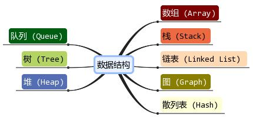

Chapter02. 数据结构基本理论
---------------------------

### 2.1 引言

数据结构是算法基础，主要有8类，本章将介绍每一种数据结构的形式及其优缺点，前四种结构较为简单，后四种较为复杂。本章只作简单介绍，以概念为主，想要详细了解，建议结合代码实现每一种数据结构。

- 数组
- 栈
- 队列
- 链表
- 树
- 散列表
- 堆
- 图




### 2.2 数组

数组是内存中连续存储多个同类型的元素的线性结构，在内存分配是连续的。一般在声明时需要指定长度，其下标就是索引。

> 特点(优点)：
>
> - 依据下标索引插叙速度快。
> - 通过下标索引遍历数组。
>
> 缺点：
>
> - 数组大小固定，无法扩容
>
> - 数组只能存储一种类型数据
> - 由于数组固定顺序，insert和delete操作需要移动其他元素，导致操作速度慢
>
> 使用场景：频繁查询，存储空间要求不大，如数学上的一维向量，二维矩阵一般采用数组存储。

常用方法：sort()，length()

### 2.3 栈(Stack)

栈是一种特殊的线性表，也是顺序结构，仅能在线性表操作，栈顶允许操作，栈底不允许操作，其特点在于先进后出LIFO，后进先出。从栈顶put元素叫做入栈，取出元素叫做出栈。

使用场景：栈结构适合使用在递归场景，斐波那契数列，数制转化求余法。

常用方法：push(),pop(),peek(),search()

### 2.4 队列

队列与栈类似，也是顺序线性表，不同的是，队列可以在两端操作，并且是先进先出，FIFO。在尾端添加元素称为入队，从首端取出数据称为出队。

使用场景：队列的特点在于先进先出，常用于多线程阻塞队列管理。

### 2.5 链表

链表在物理存储单元是非连续，非顺序的。数据元素通过链表的指针串联起来，每个元素都有两个指针，一个指向本元素数据域的内存空间，另一个指针(本元素的指针域)指向下一个结点的指针域。

根据指针的指向，可以分为单向链表，双向链表，双向链表。

> 优点：
>
> - 链表不需要初始化容量，可以任意加减元素
>
> - 添加删除元素只需要改变前后两个元素结点的指针域指向，添加和删除十分方便
>
> 缺点:
>
> - 链表没有索引，每次查询都需要遍历，查询耗时
>
> - 含有大量指针域，占用空间较大

适用场景：数据量小，频繁增加和删除场景

### 2.6 树

数是一种层次结构，根在上，叶在下。每一条支路是一个链表，可以理解多个链表的交叉网络。定义为n个结点的有限集合，n>0。

数分为二叉树和多叉树，二叉树较为常用，多叉树本质上与二叉树一致，具有以下特点：

- 每个节点有0个或者多个子节点
- 没有父节点的结点称为根结点，一棵树只有一个根结点
- 每个非根结点有且只有一个父节点
- 除了根节点外，每个子节点可以分为多个不相交的子树

**结点分类**

> - 结点拥有的子树数称为结点的度（Degree）。
>
> - 度为0的结点称为叶结点（Leaf）或终端结点；度不为0的结点称为非终端结点或分支结点。
>
> - 除根节点之外，分支结点也称为内部结点。
>
> - 树的度是树内结点的度的最大值

**结点关系**

> - 结点的子树的根称为该节点的孩子（Child），相应地，该结点称为孩子的双亲（Parent）。
>
> - 同一个双亲的孩子之间互称兄弟（Sibling）。
>
> - 结点的祖先是从根结点到该节点所经分支上的所有结点（包括根结点）。
> - 以某结点为根的子树中任一结点都称为该结点的子孙。

**树的其他相关概念：** 

> - 结点的层次（Level）从根开始定义起，根为第一层，根的孩子为第二层。
>
> - 双亲在同一层的结点互称为堂兄弟。
>
> - 树中结点的最大层次称为书的深度（Depth）或高度。
>
> - 如果左右子树是有次序的，不能互换的，则称该树为有序树，否则称为无序树。
>
> - 森林（Forest）是m（m >= 0）课互不相交的树的集合。

二叉树是特殊树，二叉树在树的基础上具有如下特点：

- 每个结点最多有两棵子树，结点度最大为2
- 左子树和右子树有顺序，次序不能颠倒
- 即使某个结点只有一个子树，也要区分左右子树

二叉树的遍历，从根节点依次访问所有节点

> - **前序遍历**
>
> 	 若二叉树为空，则返回；否则，先遍历根结点，然后遍历左子树，再遍历右子树。
>
> - **中序遍历**
>
> 	 如果二叉树为空，则返回；否则，从根结点开始，先遍历左子树，然后是根结点，左后是右子树。
>
> - ###### 后续遍历
>
> 	 如果二叉树为空，则返回；否则，从根结点开始，先遍历左子树，然后遍历右子树。
>
> - **层序遍历**
> 	 如果二叉树为空，则返回；否则，从树的第一层，根结点开始访问，从上而下逐层遍历，在同一层中，按从左到右的顺序逐个结点访问。

### 2.7 散列表(Hash表)

散列表，也叫哈希表，是根据关键码和值 (key和value) 直接进行访问的数据结构，通过key和value来映射到集合中的一个位置。python中的字典和java的map。

散列表就是把Key通过一个固定的算法函数既所谓的哈希函数转换成一个整型数字，然后就将该数字对数组长度进行取余，取余结果就当作数组的下标，将value存储在以该数字为下标的数组空间里，这种存储空间可以充分利用数组的查找优势来查找元素，所以查找的速度很快。

> Addr = H（key）
>
> H为哈希函数(散列函数)，


散列表就是由一个数组和多个链表组成。

### 2.8 堆-Heap

堆是一种特殊的二叉树，是用数组实现的二叉树，所以它没有使用指针，而是通过堆属性决定树中节点的位置，自顶向下在数组放入堆的元素。

堆由如下性质：

- 堆中某个节点的值总是不大于或不小于其父节点的值；
- 堆必定是一颗完全二叉树

堆有两种：最大堆和最小堆，最大堆的父节点比每一个节点值都大，反之，最小堆的父节点比每一个节点值都小，即堆属性。

### 2.9 图

图是一种复杂的数据结构，结构形式是拓扑网络结构，常用于路径规划中。其表示法多种多样。

图G由顶点集V和边集E组成，记为G=(V,E)，其中V(G)表示图G中顶点的有限非空集；E(G)表示图G中顶点之间的关系(边)的集合。

图至少有一个顶点，可以没有边，不可以是空图。

> ###### 图的基本表示法

图 $G=(V,E)$ 由下列要素构成：

- 一组节点(verticle) V=1, … , n
- 一组边 E(edge)
- 边$(i,j)$连接了节点和j，$i$和$j$被称为相邻节点
- 节点的度(degree)是相邻节点的数量

**出度和入度**

出度和入读针对的是有向图

- 出度：对于一个顶点V，箭头远离该顶点的边数量(InDegree, 记作ID(V))
- 入度：对于一个顶点，箭头指向该顶点的边数量(OutDegree，记作OD(V))

**邻接顶点**

- 入边邻接顶点：连接该顶点的边中的起始顶点。

- 出边邻接顶点：连接该顶点的边中的结束顶点。

**集合VR**

VR 表示图中所有顶点之间关系的集合。 VR={(v1,v2),(v1,v4),(v1,v3),(v3,v4)}

> ###### 图的分类

**依据图的方向分离分类**

- 有向图：E是有向边的有限集合。此时$<u,v>$表示有向边，简称弧。

- 无向图：E是无向边的有限集合。此时$(u,v)$或$(v,u)$表示顶点无序对。

**简单图**：

- 不存在重复边
- 不存在顶点到自身的边

**多重图：**

- 两个结点直接边数多于一条，允许顶点到自身的边

**完全图：**

- 无向图中任意两点之间都存在图称为无向完全图；
- 有向图中任意两点之间都存在方向相反的两条弧称为有向完全图。

具有 n 个顶点的完全图，图中边的数量为 n(n-1)/2；而对于具有 n 个顶点的有向完全图，图中弧的数量为 n(n-1)

**子图**

若两个图$G1=(V1,E1),G2=(V1,E2)$,$V2$是$V1$的子集且$E2$是$E1$的子集，称G2是G1的子图

**连通，连通图，连通分量**

针对无向图。在无向图中，两顶点间有边连接，称为连通的。若任意两顶点都连通，称此图为连通图。无向图中的极大连通子图称为连通量。

**强连通图，强连通量**

针对有向图。在有向图中，两顶点两个方向都有路径，两顶点称为强连通。若任一顶点都是强连通图。有向图中的极大强连通子图为有向图的强连通分量。

**路径和回路**

无论是无向图还是有向图，从一个顶点到另一顶点途径的所有顶点组成的序列（包含这两个顶点），称为一条路径。如果路径中第一个顶点和最后一个顶点相同，则此路径称为"回路"（或"环"）。

并且，若路径中各顶点都不重复，此路径又被称为"简单路径"；同样，若回路中的顶点互不重复，此回路被称为"简单回路"（或简单环）。

在有向图中，每条路径或回路都是有方向的。

**权和网的含义**

在某些实际场景中，图中的每条边（或弧）会赋予一个实数来表示一定的含义，这种与边（或弧）相匹配的实数被称为"权"；

带权的图通常称为网。

**有向无环图(DAG图)**

如果一个有向图无法从某个顶点出发经过若干条边回到该点，则这个图是一个有向无环图。

有向无环图应用在区块链中。

> ###### 图的其他概念

**生成树**

生成树：遍历连通图，依据访问过程，将图展开成一个普通树，即为生成树。

> 连通图中，由于任意两顶点之间可能含有多条通路，遍历连通图的方式有多种，往往一张连通图可能有多种不同的生成树与之对应。

连通图中的生成树必须满足以下 2 个条件：

- 包含连通图中所有的顶点；

- 任意两顶点之间有且仅有一条通路；

连通图的生成树具有特征：边数量=顶点树-1

**生成森林**

生成树针对的是连通图，生成森林针对的非连通图。

非连通图可以分解为多个连通分量，每个连通分量又各自对应多个生成树，由这些生成树构成森林即非连通图的生成森林。

> ###### 图的存储结构

**顺序存储结构—邻接矩阵**

采用两个数组，一个一维数组存储顶点，一个二维数组存储顶点之间的关系。二维数组称为邻接矩阵，显然是一个n阶方阵。两个数组可以通过下标建立索引关系从而建立了顶点与边的关系。

- 无向图的邻接矩阵是对称矩阵，n个顶点的无向图需要$n*(n+1)/2$个空间大小

- 有向图的邻接矩阵不一定对称，n个顶点的有向图需要$n^2$的存储空间

- 无向图中第 $i$ 行的非零元素的个数为顶点$V_i$的度

- 有向图中第 $i$ 行的非零元素的个数为顶点 $V_i$ 的出度，第i列的非零元素的个数为顶点$ V_i $的入度。

对于邻接矩阵，具体的定义规则

- 如果G是无向图，则：

```mathematica
  A[i][j]=1：若(i,j)∈E(G)   0:其他
```

- 如果G是有向图，则：

```mathematica
  A[i][j]=1：若<i,j>∈E(G)  0:其他
```

- 如果G是带权无向图，则：

```mathematica
  A[i][j]= w[i][j] ：若i≠j且(i,j)∈E(G)    0：i=j    ∞：其他
```

- 如果G是带权有向图，则：

``` mathematica
A[i][j]=  w[i][j] ：若i≠j且<i,j>∈E(G)   0：i=j　∞：其他
```

**邻接表存储结构**

为图G的每一个链表建立一个单链表，每条链表的表头元素为图的顶点，链表元素为该顶点与邻接顶点的边信息。

- 无向图顶点的度为该顶点对应链表的结点数量。

- 有向图的邻接表：

	默认邻接表只存储指向该顶点的邻接顶点

	逆邻接表只存储以顶点为头的邻接顶点

特点：

- 邻接表表示不唯一。
- 邻接表判断两个顶点是否存在表需要查询两个单链表

- 邻接表存储节省存储空间，特别在边稀疏的情况下(E<<n(n-1)/2)
- 邻接表适合无向图的存储，因为有向图的邻接表只存储部分邻接顶点的关系。

**十字链表存储结构**

十字链表适合存储有向图，是邻接表与逆邻接表的结合。

每一条链表由顶点node和边node组成


首元节点中有一个数据域和两个指针域（分别用 firstin 和 firstout 表示）：

- firstin 指针用于连接以当前顶点为弧头的其他顶点构成的链表；
- firstout 指针用于连接以当前顶点为弧尾的其他顶点构成的链表；
- data 用于存储该顶点中的数据；


十字链表中普通节点的存储分为 5 部分内容，它们各自的作用是：

- tailvex 用于存储以首元节点为弧尾的顶点位于数组中的位置下标；
- headvex 用于存储以首元节点为弧头的顶点位于数组中的位置下标；
- hlink 指针：用于链接下一个存储以首元节点为弧头的顶点的节点；
- tlink 指针：用于链接下一个存储以首元节点为弧尾的顶点的节点；
- info 指针：用于存储与该顶点相关的信息，例如量顶点之间的权值；


如上图所示，横向表示出度，纵向是入度

**邻接多重表**

邻接多重表仅适用于存储无向图或无向网


- data：存储此顶点的数据；
- firstedge：指针域，用于指向同该顶点有直接关联的存储其他顶点的节点。


- mark：标志域，用于标记此节点是否被操作过，例如在对图中顶点做遍历操作时，为了防止多次操作同一节点，mark 域为 0 表示还未被遍历；mark 为 1 表示该节点已被遍历；
- ivex 和 jvex：数据域，分别存储图中各边两端的顶点所在数组中的位置下标；
- ilink：指针域，指向下一个存储与 ivex 有直接关联顶点的节点；
- jlink：指针域，指向下一个存储与 jvex 有直接关联顶点的节点；
- info：指针域，用于存储与该顶点有关的其他信息，比如无向网中各边的权；


**边集数组**

集数组是由两个一维数组构成，一个是存储顶点的信息，另一个是存储边的信息，这个边数组每个数据元素由一条边的起点下标（begin），终点下标（end）和权（weight）组成。

> ###### 图的遍历

**深度优先搜索DFS**

深度优先搜索，是从图中的一个顶点出发，每次遍历当前访问顶点的临界点，一直到访问的顶点没有未被访问过的临界点为止。然后采用依次回退的方式，查看来的路上每一个顶点是否有其它未被访问的临界点。访问完成后，判断图中的顶点是否已经全部遍历完成，如果没有，以未访问的顶点为起始点，重复上述过程。

**广度优先搜索BFS**

广度优先搜索类似于树的层次遍历。从图中的某一顶点出发，遍历每一个顶点时，依次遍历其所有的邻接点，然后再从这些邻接点出发，同样依次访问它们的邻接点。按照此过程，直到图中所有被访问过的顶点的邻接点都被访问到。最后还需要做的操作就是查看图中是否存在尚未被访问的顶点，若有，则以该顶点为起始点，重复上述遍历的过程。

**深度优先生成树和广度优先生成树**

由深度优先搜索得到的树为深度优先生成树，广度优先搜索生成的树为广度优先生成树