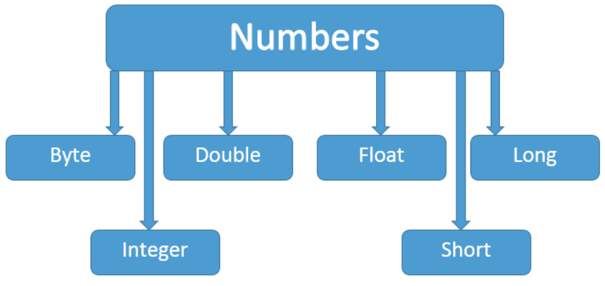
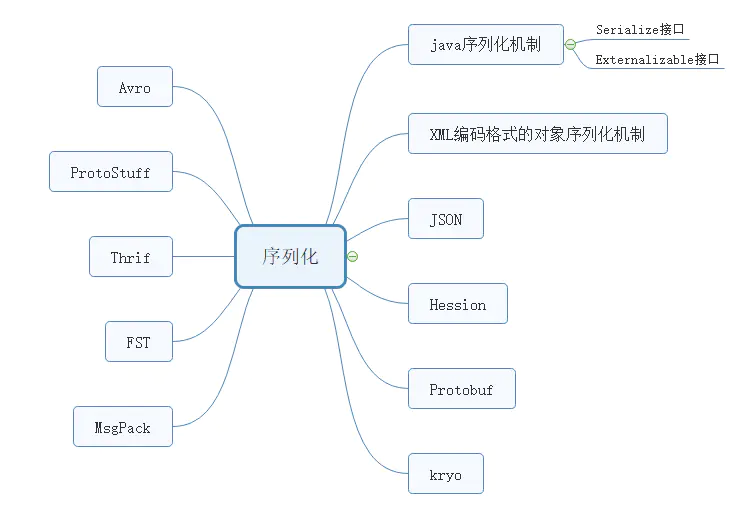

## Chapter01. java基本数据类型与包装类

### 1.1 内置基本数据类型

java有8种基本数据类型，4种整数类型,2种浮点数类型，1种字符型，1中布尔型

| 类型            | 位数 | 默认值 | 范围           | 实例               |
| --------------- | ---- | ------ | -------------- | ------------------ |
| byte(位)        | 8    | 0      | -2^7 –2^7-1    | byte b = 100;      |
| short(短整数)   | 16   | 0      | -2^15 --2^15-1 | short s = 100;     |
| int(整数)       | 32   | 0      | -2^31 --2^31-1 | int i = 100;       |
| long(长整数)    | 64   | 0      | -2^63 – 2^63-1 | long l = 100l;     |
| float(单精度)   | 32   | 0.0    | -2^31 —2^31-1  | float f = 100.0f;  |
| double(双精度)  | 64   | 0.0    | -2^63 – 2^63-1 | double d = 100.0d; |
| char(字符)      | 16   | 空     | 0 – 2^16-1     | char c= 'c';       |
| boolean(布尔值) | 8    | false  | true、false    | boolean b = true;  |

### 1.2 包装类

包装类的继承关系



基本类型与包装类的转化关系:

| 基本类型 | byte | short | int     | long | float | double | char      | boolean |
| -------- | ---- | ----- | ------- | ---- | ----- | ------ | --------- | ------- |
| 包装类   | Byte | Short | Integer | Long | Float | Double | Character | Boolean |

JDK5新特性 自动装箱，自动拆箱，将包装类当作基本类型使用

- 自动装箱：把基本类型转换为包装类类型

- 自动拆箱：把包装类类型转换为基本类型

> ###### 注意

对于Integer派别(如下表)的构造，在(-128,128)范围内，自动装箱会从常量池中取得，而超过范围则会New一个对象,其内部通过valueOf方法实现

| 包装类 | Short        | Interget     | Long         | Charater |
| ------ | ------------ | ------------ | ------------ | -------- |
| 范围   | （-128,128） | （-128,128） | （-128,128） | [0,128)  |

``` java
Integer int1= 127;

Integer int2 = 127;

System.out.println(int1 == int2);

System.out.println(int1.equals(int2));

System.out.println("-----------");

Integer int3 = 128;

Integer int4 = 128;

System.out.println(int3 == int4);

System.out.println(i3.equals(i4));
```

``` java
//equals方法源码 
@Override
 public boolean equals(Object o) {
    return (o instanceof Integer) && (((Integer) o).value == value);
 }
```

> ###### 构造方法(以Interger为例)

`Integer( int value)`：构造一个新分配的 Integer 对象，它表示指定的 int 值。

`Integer(String s)`：构造一个新分配的 Integer 对象，它表示 String`参数所指示的 int 值。

> ###### 常用方法(以Interger为例)

public static Integer valueOf(int i)： 返回一个表示指定int值得Integer实例。手动装箱

public static Integer valueOf(String s)： 返回一个表示指定String值得Integer实例。

public int intvalue()：以int类型返回该Integer的值。手动拆箱

public static String toString(int i)： 返回一个表示指定整数的String对象。

public String toString()： 返回一个表示该Integer值的String对象。

### 1.3 String类

声明，初始化String：

``` java
String hello= "hello world";
```

格式化输出字符串

``` java
String.format("浮点型变量的值为 " +
                   "%f, 整型变量的值为 " +
                   " %d, 字符串变量的值为 " +
                   " %s", floatVar, intVar, stringVar);
```

> 注意：字符串+具体实现由StringBuild实现

| 方法                                                         | 方法描述                                 |
| ------------------------------------------------------------ | ---------------------------------------- |
| char charAt(int index)                                       | 返回指定索引处的char值                   |
| int compareTo(Object o)<br>int compareTo(String anotherString)<br>int compareToIgnoreCase(String str) | 字符串比较                               |
| String concat(String Str)                                    | 字符串连接                               |
| boolean contentEquals(StringBuffer sb)                       | 字符串匹配查找                           |
| static String copyValueOf(char[] data)                       | 字符数组转字符串                         |
| boolean endsWith(String s)                                   | 匹配字符串尾部                           |
| boolean startWith(String s)                                  | 匹配字符串首部                           |
| boolean contains(String s)                                   | 字符串查找                               |
| boolean equalsIgnoreCase(String)                             | 忽略大小写的比较两个字符串               |
| String substring(int beginIndex,int endIndex)                | 截取字符串                               |
| int length()                                                 | 字符串的长度                             |
| boolean equals(Object anObject)                              | 字符串内容对比是否相等                   |
| int indexOf( )                                               | 返回指定字符在字符串中第一次出现处的索引 |
| int lastIndexOf)                                             | 返回字符在此字符串中最后一次出现处的索引 |
| int hashCode()                                               | 字符串的哈希码                           |
| boolean matches(String regex)                                | 检测字符串是否匹配给定的正则表达式       |
| regionMatches()                                              | 检测两个字符串在一个区域内是否相等       |
| String replace(char oldChar, char newChar)                   | 字符串替换                               |
| String[] split(String regex, int limit)                      | 字符串分割                               |
| String substring(int beginIndex, int endIndex)               | 字符串的子字符串                         |
| char[] toCharArray()                                         | 字符串转换为字符数组                     |
| String trim()                                                | 删除字符串的头尾空白符                   |
| String intern()                                              | 字符串常量池的此字符串                   |
| String toLowerCase()                                         | 转小写                                   |
| String toUpperCase()                                         | 转大写                                   |

> ###### 注意：上述所罗列方法包含了

### 1.4 StringBuild和StringBuffer

- String是只读字符串，所引用的字符串不能被改变，Stringbuffer和Stringbuilder定义的可以通过各种方法来达到简单的增删改；

- String和Stringbuilder在单线程环境下使用；

- StringBuffer在多线程环境下使用，可以保证线程同步；

- Stringbuilder 和StringBuffer 实现方法类似，均表示可变字符序列，不过StringBuffer 用synchronized关键字修饰（保证线程同步）

> ###### 构造方法：

- StringBuffer() ：构造一个其中不带字符的字符串缓冲区，初始容量为 16 个字符。
- StringBuffer(CharSequence seq)：构造一个字符串缓冲区，它包含与指定CharSequence 相同的字符。
- StringBuffer(int capacity) ：构造一个不带字符，但具有指定初始容量的字符串缓冲区。
- StringBuffer(String str)：构造一个字符串缓冲区，并将其内容初始化为指定的字符串内容。

> ###### 成员方法：

- 增 ：
	StringBuffer append(String str)
	StringBuffer insert(int offset, String str）

- 删 ：
	StringBuffer deleteCharAt(int index)
	StringBuffer delete(int start, int end)

- 改：
	public StringBuffer replace(int start,int end,String str)

- 其他：

	public StringBuffer reverse() 字符串反转

- 与String类类似方法

| 方法名                                                       | 方法描述                                         |
| :----------------------------------------------------------- | :----------------------------------------------- |
| int capacity()                                               | 返回当前容量。                                   |
| char charAt(int index)                                       | 返回此序列中指定索引处的 char值。                |
| void ensureCapacity(int minimumCapacity)                     | 确保容量至少等于指定的最小值。                   |
| void getChars(int srcBegin, int srcEnd, char[] dst, int dstBegin) | 将字符从此序列复制到目标字符数组 dst。           |
| int indexOf()                                                | 返回第一次出现的指定子字符串在该字符串中的索引。 |
| int lastIndexOf()                                            | 返回 String 对象中子字符串最后出现的位置。       |
| int length()                                                 | 返回长度（字符数）。                             |
| void setCharAt(int index, char ch)                           | 将给定索引处的字符设置为 ch。                    |
| void setLength(int newLength)                                | 设置字符序列的长度。                             |
| CharSequence subSequence(int start, int end)                 | 返回一个新的字符序列的子序列。                   |
| String substring(int start)                                  | 子字符串切片                                     |
| String substring(int start, int end)                         | 子字符串切片                                     |
| String toString()                                            | 返回此序列中数据的字符串表示形式。               |

### 1.5. java序列化



