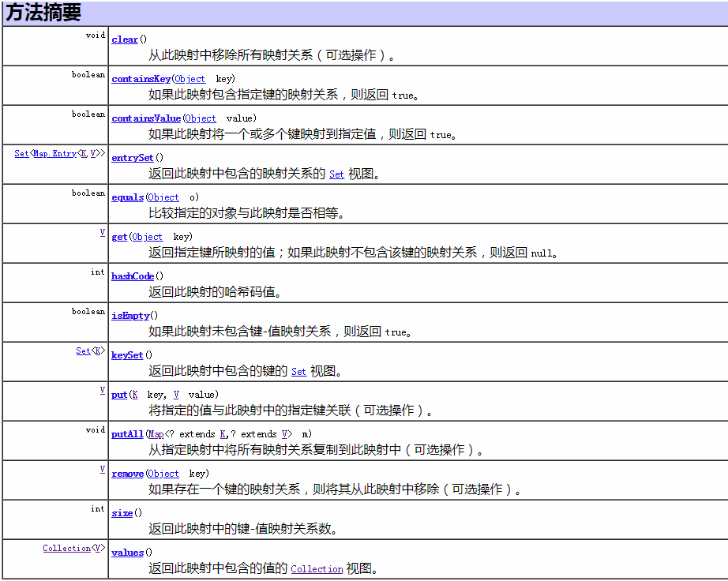

## Chapter02. java 集合框架

### 2.1引言

集合框架被设计成要满足以下几个目标。

- 该框架必须是高性能的。基本集合（动态数组，链表，树，哈希表）的实现也必须是高效的。
- 该框架允许不同类型的集合，以类似的方式工作，具有高度的互操作性。
- 对一个集合的扩展和适应必须是简单的

java内置了如下数据结构类与接口：

- 枚举（Enumeration）
- 位集合（BitSet）
- 向量（Vector）
- 栈（Stack）
- 字典（Dictionary）
- 哈希表（Hashtable）
- 属性（Properties）


所有集合类都位于**java.util**包下。Java的集合类主要由两个接口派生而出：**Collection**和**Map**，Collection和Map是Java集合框架的根接口，这两个接口又包含了一些子接口或实现类。

- 集合接口：6个接口（短虚线表示），表示不同集合类型，是集合框架的基础。
- 抽象类：5个抽象类（长虚线表示），对集合接口的部分实现。可扩展为自定义集合类。
- 实现类：8个实现类（实线表示），对接口的具体实现。
- Collection 接口是一组允许重复的对象。
- Set 接口继承 Collection，集合元素不重复。
- List 接口继承 Collection，允许重复，维护元素插入顺序。
- Map接口是键－值对象，与Collection接口没有什么关系。

Set、List和Map可以看做集合的三大类：

- List集合是有序集合，集合中的元素可以重复，访问集合中的元素可以根据元素的索引来访问。
- Set集合是无序集合，集合中的元素不可以重复，访问集合中的元素只能根据元素本身来访问（也是集合里元素不允许重复的原因）。
- Map集合中保存Key-value对形式的元素，访问时只能根据每项元素的key来访问其value。

具体地分析如下：

Collection接口是Set,Queue,List的父接口，List代表了有序可重复集合，可直接根据元素的索引来访问；Set代表无序不可重复集合，只能根据元素本身来访问；Queue是队列集合；Map代表的是存储key-value对的集合，可根据元素的key来访问value。

- List是一个有序的队列，实现类有4个：LinkedList, ArrayList, Vector, Stack。

- Set是一个不允许有重复元素的集合。实现类有3个：TreeSet、HastSet、LinkHastSet。

Map是一个映射接口，即key-value键值对。

- AbstractMap是个抽象类，它实现了Map接口中的大部分API。实现类有6个：TreeMap、HashMap、LinkHashMap、IdentityHashMap、WeakHashMap、HashTable

- SortedMap 是继承于Map的接口。内容是排序的键值对，通过比较器(Comparator)

Iterator是遍历集合的工具，即我们通常通过Iterator迭代器来遍历集合。

Collections是算法实现类

集合可以看作是一种容器，用来存储对象信息。所有集合类都位于java.util包下，但支持多线程的集合类位于java.util.concurrent包下。

数组与集合的区别如下：

　　1）数组长度不可变化而且无法保存具有映射关系的数据；集合类用于保存数量不确定的数据，以及保存具有映射关系的数据。

　　2）数组元素既可以是基本类型的值，也可以是对象；集合只能保存对象。

### 2.2 Collection

Collection接口中的方法,详细可以查看api文档

> - boolean add(E,e)
> - boolean addALl(Collection<? extends E> e)
> - void clear()            移除所有元素
> - boolean contains(Object o)
> - boolean containsALL(Collection<?> c)
> - boolean equals(Object o)
> - int hashCode()
> - boolean isEmpty()
> - Iterator<E> iterator()   返回在此collection元素上进行的迭代器
> - boolean remove(Object o)
> - boolean retainAll(Collection<?> c)
> - int size()
> - Object[] toArray()
> - <T> T[] toArray(T[] a)                        

### 2.3 Iterator接口

Iterator接口经常被称作迭代器，它是Collection接口的父接口。但Iterator主要用于遍历集合中的元素。Iterator接口中定义了3个方法

> - boolean hasNext()
> - E next()
> - void remove

``` java
public class IteratorExample {
    public static void main(String[] args){
        //创建集合，添加元素  
        Collection<Day> days = new ArrayList<Day>();
        for(int i =0;i<10;i++){
            Day day = new Day(i,i*60,i*3600);
            days.add(day);
        }
        //获取days集合的迭代器
        Iterator<Day> iterator = days.iterator();
        while(iterator.hasNext()){//判断是否有下一个元素
            Day next = iterator.next();//取出该元素
            //逐个遍历，取得元素后进行后续操作
            .....
        }
    }
}
```

子接口ListIterator，双向迭代器，在Iterator上实现了3个方法

> - void add()
> - E previous()
> - boolean hasPrevious()

terator和Iterable的区别：

- Iterator是迭代器接口，而Iterable是为了只要实现该接口就可以使用foreach进行迭代。

- Iterable中封装了Iterator接口，只要实现了Iterable接口的类，就可以使用Iterator迭代器了。

- 集合Collection、List、Set都是Iterable的实现类，所以他们及其他们的子类都可以使用foreach进行迭代。
- Iterator中核心的方法next()、hasnext()、remove()都是依赖当前位置，如果这些集合直接实现Iterator，则必须包括当前迭代位置的指针。当集合在方法间进行传递的时候，由于当前位置不可知，所以next()之后的值，也不可知。而实现Iterable则不然，每次调用都返回一个[从头开始](https://www.baidu.com/s?wd=从头开始&tn=24004469_oem_dg&rsv_dl=gh_pl_sl_csd)的迭代器，各个迭代器之间互不影响。

``` java
// Iterable接口源码
public interface Iterable<T> {
  Iterator<T> iterator();
}
// Iterator源码
public interface Iterator<E> {
    boolean hasNext();
    E next();
}
```

### 2.4 Set 集合接口

Set是一种不包括重复元素的Collection。它维持它自己的内部排序，所以随机访问没有任何意义。与List一样，它同样允许null的存在但是仅有一个。需要注意的是:虽然Set中元素没有顺序，但是元素在set中的位置是由该元素的HashCode决定的，其具体位置其实是固定的。不重复性也是取决于HashCode和equals.

由于Set接口的特殊性，所有传入Set集合中的元素都必须不同，同时要注意任何可变对象，如果在对集合中元素进行操作时，导致e1.equals(e2)==true，则必定会产生某些问题。

Set集合与Collection方法相同，Set集合不允许存储相同元素，当add相同元素，返回false，并且添加失败。

Set集合有三个实现类，HashSet类，LinkHashSet类，TreeSet类.

#### HashSet类-散列集

HashSet 是一个没有重复元素的集合。它是由HashMap实现的，不保证元素的顺序(这里所说的没有顺序是指：元素插入的顺序与输出的顺序不一致)，而且HashSet允许使用null 元素。HashSet是非同步的，如果多个线程同时访问一个哈希set，而其中至少一个线程修改了该set，那么它必须保持外部同步。 HashSet按Hash算法来存储集合的元素，因此具有很好的存取和查找性能。

HashSet的实现方式大致如下，通过一个HashMap存储元素，元素是存放在HashMap的Key中，而Value统一使用一个Object对象。

HashSet使用和理解中容易出现的误区:

- HashSet中存放null值
   HashSet中是允许存入null值的，但是在HashSet中仅仅能够存入一个null值。

- HashSet中存储元素的位置是固定的
   HashSet中存储的元素的是无序的，这个没什么好说的，但是由于HashSet底层是基于Hash算法实现的，使用了hashcode，所以HashSet中相应的元素的位置是固定的。

- 必须小心操作可变对象（Mutable Object）。如果一个Set中的可变元素改变了自身状态导致Object.equals(Object)=true将导致一些问题。

#### LinkedHashSet类-链式散列集

LinkedHashSet继承自HashSet，其底层是基于LinkedHashMap来实现的，有序，非同步。LinkedHashSet集合同样是根据元素的hashCode值来决定元素的存储位置，但是它同时使用链表维护元素的次序。这样使得元素看起来像是以插入顺序保存的，也就是说，当遍历该集合时候，LinkedHashSet将会以元素的添加顺序访问集合的元素。

#### TreeSet类-树形集

TreeSet是一个有序集合，其底层是基于TreeMap实现的，非线程安全。TreeSet可以确保集合元素处于排序状态。TreeSet支持两种排序方式，自然排序和定制排序，其中自然排序为默认的排序方式。当我们构造TreeSet时，若使用不带参数的构造函数，则TreeSet的使用自然比较器；若用户需要使用自定义的比较器，则需要使用带比较器的参数。

注意：TreeSet集合不是通过hashcode和equals函数来比较元素的.它是通过compare或者comparaeTo函数来判断元素是否相等.compare函数通过判断两个对象的id，相同的id判断为重复元素，不会被加入到集合中。

#### EnumSet类-枚举

EnumSet是一个专为枚举类设计的集合类，不允许添加null值。EnumSet的集合元素也是有序的，它以枚举值在Enum类内的定义顺序来决定集合元素的顺序。

### 2.5 Queue

Queue接口与List、Set同一级别，都是继承了Collection接口。LinkedList实现了Queue接口。我们平时使用的一些常见队列都是非阻塞队列，比如优先级队列PriorityQueue、LinkedList(LinkedList是双向链表，它实现了Dequeue接口)

子接口：阻塞队列BlockingQueue, 双向队列Deque

实现类：LinkedList, ArrayBlockingQueue, LinkedBlockingQueue,PriorityQueue,PriorityBlockingQueue

常用方法：

> - boolean add(E e) 插入
> - E element() 获取但不移除队列头
> - boolean offer(E e) 插入
> - E peek()   获取但不移除队列头
> - E poll()  获取并且移除队列头
> - E remove() 获取并移除队列头

#### 非阻塞队列

内置的不阻塞队列： 优先级队列PriorityQueue 和 ConcurrentLinkedQueue
　　PriorityQueue 和 ConcurrentLinkedQueue 类在 Collection Framework 中加入两个具体集合实现。 

- PriorityQueue 是一个基于优先级的无界优先级队列。实质上维护了一个有序列表，加入到 Queue 中的元素根据它们的天然排序（通过其 java.util.Comparable 实现）或者根据传递给构造函数的 java.util.Comparator 实现来定位。
- ConcurrentLinkedQueue 是基于链接节点的、线程安全的队列。并发访问不需要同步。因为它在队列的尾部添加元素并从头部删除它们，所以只要不需要知道队列的大 小，ConcurrentLinkedQueue 对公共集合的共享访问就可以工作得很好。收集关于队列大小的信息会很慢，需要遍历队列。

#### 阻塞队列

JDK7提供了7个阻塞队列。分别是

- ArrayBlockingQueue ：一个由数组结构组成的有界阻塞队列。FIFO
- LinkedBlockingQueue ：一个由链表结构组成的可选有界阻塞队列。如果未指定容量，那么容量将等于 `Integer.MAX_VALUE`。FIFO
- PriorityBlockingQueue ：一个支持优先级排序的无界阻塞队列。
- DelayQueue：一个使用优先级队列实现的无界阻塞队列,，只有在延迟期满时才能从中提取元素。
- SynchronousQueue：一个不存储元素、没有内部容量的阻塞队列。
- LinkedTransferQueue：一个由链表结构组成的无界阻塞TransferQueue队列。
- LinkedBlockingDeque：一个由链表结构组成的可选范围双向阻塞队列。如果未指定容量，那么容量将等于 `Integer.MAX_VALUE`。

### 2.6 List接口

List集合代表一个有序集合，集合中每个元素都有其对应的顺序索引。List集合允许使用重复元素，可以通过索引来访问指定位置的集合元素。

List接口继承于Collection接口，它可以定义一个允许重复的**有序集合**。因为List中的元素是有序的，所以我们可以通过使用索引（元素在List中的位置，类似于数组下标）来访问List中的元素，这类似于Java的数组。

List接口为Collection直接接口。List所代表的是有序的Collection，即它用某种特定的插入顺序来维护元素顺序。用户可以对列表中每个元素的插入位置进行精确地控制，同时可以根据元素的整数索引（在列表中的位置）访问元素，并搜索列表中的元素。实现List接口的集合主要有：ArrayList、LinkedList、Vector、Stack。

List接口除了继承Collection,还有有如下方法

> - void add(int index, Object element)
> - Object get(index)
> - int indexOf(Object o)
> - int lastIndexOf(Object o)
> - Objectt(remove int index)
> - Object set(int index, Object element)
> - List subList(int fromindex, int toIndex)
> - Object[] toArray()
>
> java 8 为List接口添加两个默认方法
>
> replaceAll(UnaryOprator operator) 根据operator指定计算规则重新设置list集合元素
>
> void sort(Compator c)  根据Comparot参数对List集合的元素排序 

#### **ArrayList**

ArrayList是一个动态数组，也是我们最常用的集合，是List类的典型实现。它允许任何符合规则的元素插入甚至包括null。每一个ArrayList都有一个初始容量（10），该容量代表了数组的大小。随着容器中的元素不断增加，容器的大小也会随着增加。在每次向容器中增加元素的同时都会进行容量检查，当快溢出时，就会进行扩容操作。所以如果我们明确所插入元素的多少，最好指定一个初始容量值，避免过多的进行扩容操作而浪费时间、效率。

ArrayList擅长于随机访问。同时ArrayList是非同步的。

#### **LinkList**

LinkedList是List接口的另一个实现，除了可以根据索引访问集合元素外，LinkedList还实现了Deque接口，可以当作双端队列来使用，也就是说，既可以当作“栈”使用，又可以当作队列使用。

LinkedList的实现机制与ArrayList的实现机制完全不同，ArrayLiat内部以数组的形式保存集合的元素，所以随机访问集合元素有较好的性能；LinkedList内部以链表的形式保存集合中的元素，所以随机访问集合中的元素性能较差，但在插入删除元素时有较好的性能。

#### **Vector**

 与ArrayList相似，但是Vector是同步的。所以说Vector是线程安全的动态数组。它的操作与ArrayList几乎一样。

#### **Stack**

Stack继承自Vector，实现一个后进先出的堆栈。Stack提供5个额外的方法使得Vector得以被当作堆栈使用。基本的push和pop 方法，还有peek方法得到栈顶的元素，empty方法测试堆栈是否为空，search方法检测一个元素在堆栈中的位置。Stack刚创建后是空栈。

### 2.7 Map接口

Map接口采用键值对Map<K,V>的存储方式，保存具有映射关系的数据，因此，Map集合里保存两组值，一组值用于保存Map里的key，另外一组值用于保存Map里的value，key和value可以是任意引用类型的数据。key值不允许重复，可以为null。如果添加key-value对时Map中已经有重复的key，则新添加的value会覆盖该key原来对应的value。常用实现类有HashMap、LinkedHashMap、TreeMap等。

常用方法:



#### **HashMap与Hashtable**

HashMap与Hashtable是Map接口的两个典型实现，它们之间的关系完全类似于ArrayList与Vertor。HashTable是一个古老的Map实现类，它提供的方法比较繁琐，目前基本不用了，HashMap与Hashtable主要存在以下两个典型区别：

- HashMap是线程不安全，HashTable是线程安全的。

- HashMap可以使用null值最为key或value；Hashtable不允许使用null值作为key和value，如果把null放进HashTable中，将会发生空指针异常。

为了成功的在HashMap和Hashtable中存储和获取对象，用作key的对象必须实现hashCode()方法和equals()方法。

HashMap工作原理如下：

HashMap基于hashing原理，通过put()和get()方法存储和获取对象。当我们将键值对传递给put()方法时，它调用建对象的hashCode()方法来计算hashCode值，然后找到bucket位置来储存值对象。当获取对象时，通过建对象的equals()方法找到正确的键值对，然后返回对象。HashMap使用链表来解决碰撞问题，当发生碰撞了，对象将会存储在链表的下一个节点中。

#### LinkedHashMap实现类

LinkedHashMap使用`双向链表`来维护key-value对的次序（其实只需要考虑key的次序即可），该链表负责维护Map的迭代顺序，与插入顺序一致，因此性能比HashMap低，但在迭代访问Map里的全部元素时有较好的性能。

#### Properties

Properties类是Hashtable类的子类，它相当于一个key、value都是String类型的Map，主要用于读取配置文件。

#### TreeMap实现类

TreeMap是SortedMap的实现类，是一个`红黑树`的数据结构，每个key-value对作为红黑树的一个节点。TreeMap存储key-value对时，需要根据key对节点进行排序。TreeMap也有两种排序方式：

- 自然排序：TreeMap的所有key必须实现Comparable接口，而且所有的key应该是同一个类的对象，否则会抛出ClassCastException。
- 定制排序：创建TreeMap时，传入一个Comparator对象，该对象负责对TreeMap中的所有key进行排序。

#### 各Map实现类的性能分析

- HashMap通常比Hashtable（古老的线程安全的集合）要快

- TreeMap通常比HashMap、Hashtable要慢，因为TreeMap底层采用红黑树来管理key-value。

- LinkedHashMap比HashMap慢一点，因为它需要维护链表来爆出key-value的插入顺序。　 