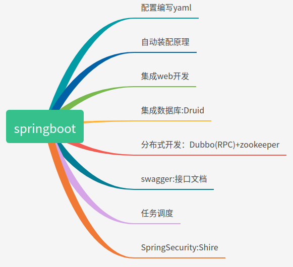
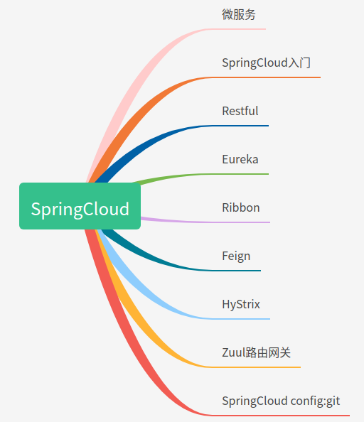
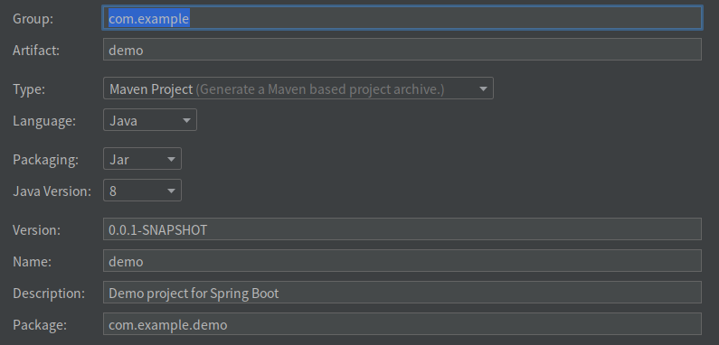
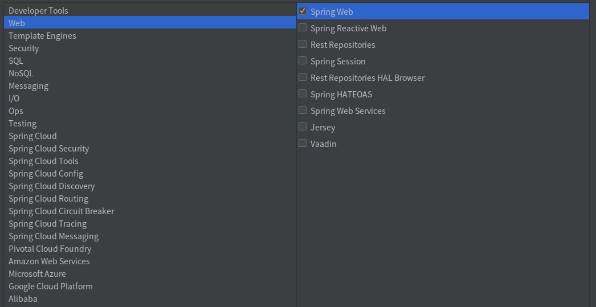

## Chapter01. SpringBoot入门

### 1. 引言

#### 1.1 开发工具演变

开发演变流程

javase:OOP

mysql:持久化

html+css+js+jquery+框架：view

javaweb:基本mvc三层架构网站

ssm:简化开发流程

war包：tomcat运行

spring再简化：SpringBoot,内嵌tomcat

springcloud

#### 1.2 微服务技术栈

- **概念：**把一个大型的单个应用程序和服务拆分为数个甚至数十个的支持微服务，它可扩展单个组件而不是整个的应用程序堆栈，从而满足服务等级协议。

- **定义：**围绕业务领域组件来创建应用，这些应用可独立地进行开发、管理和迭代。在分散的组件中使用云架构和平台式部署、管理和服务功能，使产品交付变得更加简单。

- **本质：**用一些功能比较明确、业务比较精练的服务去解决更大、更实际的问题。





### 2.第一个SpringBoot程序

- 方式一：Spring官网quickStart生成一个项目

- 方式二：(**推荐**)通过IDEA新建项目，Spring Initializr新建一个项目，根据需要选择各类组件。





**注意**：在Applictaion同级目录下建包，pojo，dao，service,controller等

程序入口：application类

配置文件：resource/

在application.properties文件可以修改端口等

``` properties
# 配置文件
#修改端口号
server.port=8081
```

### 1.3 Springboot自动配置原理

自动配置

pom.xml

- spring-boot-dependencies:核心依赖在父工程中！

- 引入SpringBoot依赖，不需要指定版本，因为存在版本仓库

- 启动器：start,自动导入SpringBoot的启动场景

	Spring-boot-starter-web会带入web环境所有依赖，根据所需功能组件，导入start即可

	``` xml
	        <dependency>
	            <groupId>org.springframework.boot</groupId>
	            <artifactId>spring-boot-starter-web</artifactId>
	        </dependency>
	```

